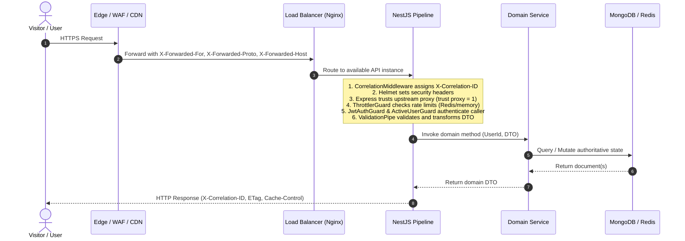

# Scalable Production Architecture & Component Design

> **Scope**: Horizontally scalable modular monolith topology, runtime architecture, domain boundaries, data lifecycles, real-time scaling, Vault secret management, Redis integration, CDN edge caching, and failure boundaries.  
> **Source of Truth**: Implementation across `apps/api`, `apps/web`, `packages/shared`, `nginx/`, and `docker-compose.yml`.  
> **Last Verified**: 2026-09-25

---

## 1. System Topology

The platform is engineered as a high-throughput, horizontally scalable SaaS modular monolith designed to support high concurrent user traffic and public form submission spikes.

```text
                         INTERNET
                            │
                            ▼
                 ┌─────────────────────┐
                 │  Global Edge Layer  │
                 │  CDN + WAF + DDoS   │
                 │ TLS + Rate Limiting │
                 └──────────┬──────────┘
                            │
                    ┌───────┴────────┐
                    │                │
                    ▼                ▼
             Web Application    API Load Balancer (Nginx)
             (React 19 SPA)          │
                    │       ┌────────┼────────┐
                    │       ▼        ▼        ▼
                    │     API-1    API-2    API-N
                    │  (NestJS Horizontally Scaled Monolith)
                    │       │        │        │
                    │       └────────┼────────┘
                    │                │
                    │       ┌────────┼─────────┐
                    │       ▼        ▼         ▼
                    │     Redis    Vault     MongoDB
                    │  (State)   (Secrets)  (Primary)
                    ▼
               Object Storage
              (MinIO / S3 / Local)
```

---

## 2. Modular Monolith Domain Boundaries

Backend responsibilities are strictly encapsulated in NestJS modules that separate core business domains from infrastructure implementations:

```text
apps/api/src/
├── identity/          # Authentication, user accounts, JWT issuance, profile management, active checks
├── forms/             # Form authoring, single mutable draft, settings, deployments, version history
├── runtime/           # Public form schema delivery, immutable version resolution, CDN ETag generation
├── submissions/       # Public submission intake, validation against immutable version, dynamic data matrix
├── administration/    # System metrics, user moderation (suspend/unsuspend), platform oversight
├── realtime/          # Socket.IO gateway, horizontal multi-instance room routing via Redis adapter
└── infrastructure/    # Platform boundary abstractions
    ├── vault/         # HashiCorp Vault secrets management & environment fallback
    ├── redis/         # Redis connection, pub/sub, distributed caching & rate limiting
    ├── storage/       # Object storage provider-independent abstraction (Local & S3)
    ├── queue/         # Asynchronous workload processing boundary
    ├── observability/ # Structured JSON logging, correlation ID tracing, health/readiness probes
    └── security/      # Helmet headers, trusted proxy configuration, Throttler rate limiting
```

* **Boundary Invariant**: Business modules (`identity`, `forms`, `runtime`, `submissions`, `administration`, `realtime`) never directly depend on low-level infrastructure drivers; they interact with clean infrastructure services (`SecretsService`, `RedisService`, `StorageService`, `QueueService`).

---

## 3. Request Lifecycle & Proxy Trust

Every incoming HTTP request flows through the following pipeline:



---

## 4. Authentication Lifecycle

1. **Registration & Login**:
   * Standard user registration (`POST /auth/register`) enforces unique email, bcrypt password hashing (10 salt rounds), and initial status `UserStatus.ACTIVE`.
   * Login (`POST /auth/login`) verifies credentials and checks `user.status !== UserStatus.SUSPENDED`.
   * Issues stateless JWT signed with `SecretsService.getJwtSecret()`.
2. **Horizontal Request Authentication**:
   * Any API instance independently verifies the JWT Bearer token using the shared Vault secret without session stickiness.
   * `ActiveUserGuard` checks that `req.user.status === UserStatus.ACTIVE`.
3. **Session Invalidation Across Cluster**:
   * When an Admin suspends a user (`PATCH /admin/users/:id/suspend`), `AdminService` updates MongoDB and calls `RealtimeService.emitUserSuspended(userId)`.
   * The event is broadcast through the Socket.IO Redis adapter across **all** running API instances to the user's connected WebSocket clients (`user:${userId}`).
   * The client terminates its active session and redirects to `/account-suspended`. Subsequent HTTP requests immediately receive `403 Forbidden` (`code: 'ACCOUNT_SUSPENDED'`).

---

## 5. Form & Version Lifecycle

The system strictly maintains the **Single Form / Single Mutable Draft / Immutable Released Versions** invariant:

```text
Form
│
├── Current Draft (Form.draft)
│      └── Single mutable AST, updated via PATCH /forms/:id/draft
│
└── Version History (FormVersion collection)
       ├── Version 1 (Immutable snapshot created upon initial Deploy)
       ├── Version 2 (Immutable snapshot created upon second Deploy)
       └── Version N (Immutable snapshot created upon subsequent Deploy)
```

### Core Invariants:
1. **Deployment and Versioning are One Operation**:
   * Triggered via `POST /forms/:id/deploy`.
   * Evaluates uniqueness of field references (`checkDuplicateReferences`).
   * Queries latest version number and creates `FormVersion` with `versionNumber = N + 1`, freezing the current draft.
   * Sets `Form.deployedVersionId = newVersion._id`.
   * Records deployment in `Form.deployments` (`isCurrent: true`) and logs activity.
2. **Draft Independence**:
   * Modifying the draft never mutates `FormVersion` documents or alters public form visitors.
   * `hasUnpublishedChanges` dynamically tracks whether the draft diverges from the active version.
3. **Rollback / Re-activation**:
   * `POST /forms/:id/versions/:versionId/deploy` points `Form.deployedVersionId` to an existing historical version without creating duplicate version snapshots.

---

## 6. Public Runtime Isolation & CDN Caching

1. **Resolution Pipeline**:
   $$\text{publicId} \longrightarrow \text{Form} \longrightarrow \text{deployedVersionId} \longrightarrow \text{Immutable FormVersion} \longrightarrow \text{Public Form Runtime}$$
2. **Draft Isolation Guarantee**:
   * The public runtime (`GET /public/forms/:publicId`) **never reads or exposes `Form.draft`**.
   * If `deployedVersionId === null`, the endpoint returns `{ isDeployed: false }`.
3. **Edge Caching & ETag Semantics**:
   * Generates a strong ETag based on version ID and update timestamp:
     `W/"${version._id}-${version.updatedAt.getTime()}"`
   * Sets header: `Cache-Control: public, no-cache`
   * When client or CDN passes `If-None-Match: <etag>`, the API immediately returns `304 Not Modified`, offloading bandwidth while guaranteeing instant reflection upon new deployments.

---

## 7. Submission Lifecycle & Data Preservation

1. **Public Intake (`POST /public/forms/:publicId/submissions`)**:
   * Gated by application rate limiting (`SubmissionThrottlerGuard`).
   * Verifies `form.settings.isAcceptingSubmissions !== false` and `submissionLimit`.
   * Enforces `required` and `validation.pattern` regex constraints against the deployed version's schema.
   * Writes immutable document to `FormSubmission` permanently tagged with `versionId`.
   * Dispatches asynchronous webhooks/notifications via `QueueService`.
2. **Cumulative Data Sheet (`GET /forms/:id/data`)**:
   * Queries all `FormVersion` records ever deployed for this form.
   * Aggregates a master set of columns across all versions.
   * Renders historical submission values in their respective columns, projecting `(empty)` for versions where a field did not exist. Historical data is never lost or orphaned when fields are removed in future versions.

---

## 8. Real-Time Architecture & Redis Scaling

* **Problem**: In a multi-node cluster, a user connected to `API-1` will not receive WebSocket events emitted by an admin connected to `API-2`.
* **Solution**: `RedisIoAdapter` attaches `@socket.io/redis-adapter` using Redis Pub/Sub:
  ```text
  Browser (User) <──> API-1 (Socket.IO) <──┐
                                           ├── Redis Pub/Sub
  Browser (Admin) <──> API-2 (Socket.IO) <─┘
  ```
* When `RealtimeService.emitUserSuspended(userId)` is invoked on any API instance, the Redis adapter broadcasts the event across all cluster nodes to room `user:${userId}`.
* In single-node development, gracefully falls back to the in-memory adapter if Redis is unconfigured.

---

## 9. Vault / Secret Management Boundary

* `SecretsService` (`src/infrastructure/vault/secrets.service.ts`) creates a hard boundary separating non-sensitive application configuration from secrets:

| Category | Storage Location | Examples |
|---|---|---|
| **Configuration** | Environment / `.env` | `NODE_ENV`, `PORT`, `FRONTEND_URL`, `TRUST_PROXY`, `LOG_LEVEL` |
| **Secrets** | HashiCorp Vault (or environment in dev) | `MONGODB_URI`, `JWT_SECRET`, `REDIS_URL`, `S3_SECRET_KEY` |

* **Startup Protocol**:
  1. If `VAULT_ENABLED === 'true'`, connects to `${VAULT_ADDR}/v1/${VAULT_PATH}` using token `VAULT_TOKEN`.
  2. Populates in-memory secret registry. In production, missing secrets trigger fail-fast termination.
  3. In development, gracefully falls back to `.env` variables.
  4. Secrets are never exposed to client bundles or logged in structured traces.

---

## 10. Database Architecture & Indexes

MongoDB is the sole authoritative transactional database. Schemas in `apps/api/src/` feature query-optimized indexes:

| Collection | Schema | Primary & Compound Indexes | Query Pattern Supported |
|---|---|---|---|
| `users` | `UserSchema` | `email` (unique, lowercase)<br/>`{ role: 1, status: 1 }`<br/>`{ createdAt: -1 }` | Authentication lookup, Admin status filter, User list sorting |
| `forms` | `FormSchema` | `publicId` (unique)<br/>`userId` (index)<br/>`deployedVersionId` (index)<br/>`{ userId: 1, updatedAt: -1 }` | Public slug resolution, Tenant isolation, Form workspace list |
| `formversions` | `FormVersionSchema` | `{ formId: 1, versionNumber: 1 }` (unique)<br/>`{ formId: 1, createdAt: -1 }` | Incremental version enforcement, Chronological release history |
| `formsubmissions` | `FormSubmissionSchema` | `{ formId: 1, createdAt: -1 }`<br/>`{ formId: 1, versionId: 1 }` | Submission data sheet sorting, Version-specific intake metrics |

---

## 11. Async Processing & Object Storage Boundaries

1. **Async Workload Boundary (`QueueService`)**:
   * Decouples synchronous HTTP request/response loops from heavy asynchronous tasks.
   * Jobs (e.g. `webhook_notification`, large dataset exports) are pushed to Redis queue `saas:jobs:queue` with resilient in-process execution fallback.
2. **Object Storage Boundary (`StorageService`)**:
   * File uploads, binary assets, and CSV export artifacts are abstracted via `StorageService`.
   * Supports `LocalStorageDriver` (local disk in `uploads/`) and `S3StorageDriver` (AWS S3 / MinIO / Cloudflare R2). Large binaries are never stored inside MongoDB documents.

---

## 12. Observability & Health Probes

1. **Request Correlation**:
   * `CorrelationMiddleware` extracts `X-Correlation-ID` or `X-Request-ID` from incoming requests or generates a unique ID (`req_${timestamp}_${hex}`).
   * Attaches the ID to `req.correlationId` and echoes it in response headers.
2. **Structured JSON Logging**:
   * `StructuredLoggerService` outputs machine-readable JSON logs in production with timestamp, log level, context, correlation ID, and message.
3. **Health Probes**:
   * `GET /health/liveness`: Returns HTTP 200 `{ status: 'ok' }` confirming event loop responsiveness.
   * `GET /health/readiness`: Verifies MongoDB connectivity (`readyState === 1`) and Redis ping. Returns HTTP 200 if ready, or HTTP 503 if primary database is unreachable.

---

## 13. Failure Boundaries & Resilience

| Component Failure | System Behavior & Mitigation |
|---|---|
| **MongoDB Down** | `/health/readiness` returns HTTP 503. Load balancer stops routing traffic to the instance until database recovers. State corruption is prevented. |
| **Redis Down** | System logs a warning and gracefully degrades: Socket.IO falls back to single-node memory adapter, rate limiting uses in-memory tracking, and queues execute in-process. Core REST API functionality remains intact. |
| **Vault Down** | In production with `VAULT_ENABLED=true`, the API refuses to start with missing secrets. In development, falls back to environment configuration. |
| **WebSocket Down** | REST API endpoints operate unaffected. The web SPA displays a disconnected indicator and retries connection automatically. |
| **Proxy / LB Down** | CDN edge layer serves cached static assets and public form schemas where valid. |

---

## 14. Security Boundaries

* **Edge Rate Limiting**: Nginx edge zones limit requests to sensitive paths (auth: 5r/s; submissions: 5r/s; general: 30r/s).
* **Application Rate Limiting**: NestJS Throttler protects application endpoints against brute-force and DDoS attacks.
* **Security Headers**: Helmet sets `X-Content-Type-Options: nosniff`, `X-Frame-Options: SAMEORIGIN`, `Strict-Transport-Security`, and cross-origin resource policies.
* **Tenant Isolation**: Every form and submission operation strictly enforces ownership (`form.userId.toString() === userId`).
* **Input Sanitization**: Global `ValidationPipe` with `whitelist: true` and `forbidNonWhitelisted: true` strips unexpected payload properties.

---

## 15. Deployment & Environment Blueprint

### Docker Multi-Container Cluster
The root [`docker-compose.yml`](file:///home/sct/dd/multi-tenant-form-builder/docker-compose.yml) provisions the complete horizontally scaled production environment:
* `edge-lb`: Nginx edge load balancer on port `80`.
* `api-1`, `api-2`: Stateless API instances on internal port `3000`.
* `web`: Production React SPA served via Nginx.
* `mongodb`: MongoDB 7.0 database.
* `redis`: Redis 7.2 distributed state and pub/sub.
* `vault`: HashiCorp Vault server on port `8200`.
* `minio`: S3-compatible Object Storage on ports `9000`/`9001`.

### Environment Matrix:
* **Development**: Local Node/Vite processes, local MongoDB, optional Redis, environment variable fallback.
* **Staging**: Docker compose cluster, isolated staging database, staging Vault path, local MinIO storage.
* **Production**: Enterprise CDN (Cloudflare/CloudFront) $\to$ Kubernetes/ECS multi-instance API deployment $\to$ Managed MongoDB Replica Set + Managed Redis Cluster + HashiCorp Vault. Production secrets are never reused from development.
