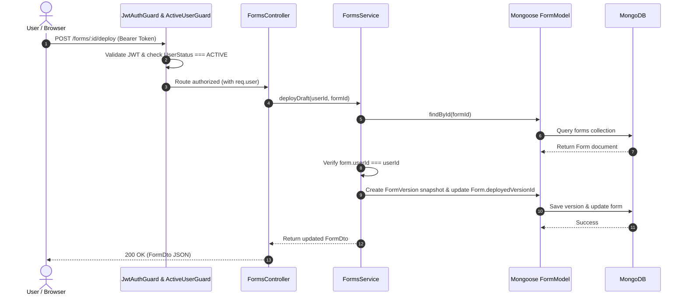
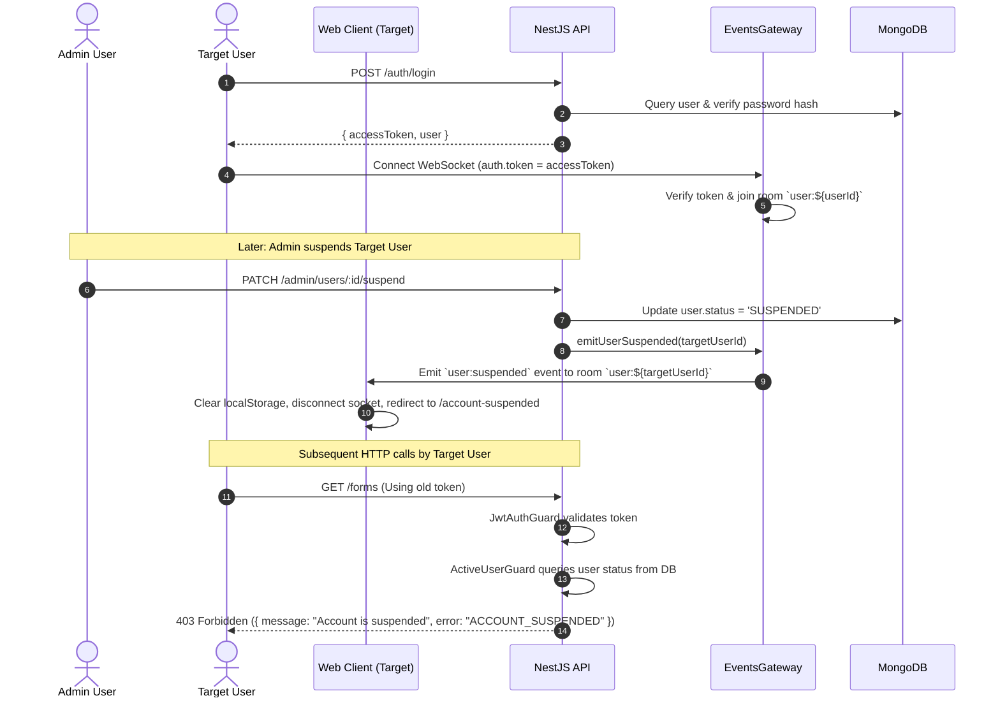
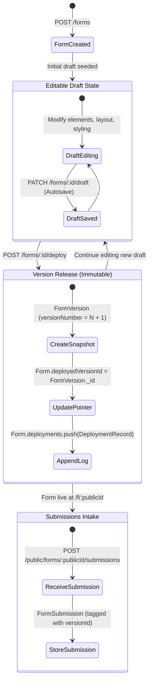

# System Architecture & Component Design

> **Scope**: System topology, runtime architecture, data flows, authentication lifecycle, and scaling boundaries.  
> **Source of Truth**: Implementation across `apps/api`, `apps/web`, `packages/shared`, and `package.json`.  
> **Last Verified**: 2026-09-24

---

## 1. System Overview

The application is a full-stack SaaS Form Building and Submission Platform built as a pnpm monorepo. It consists of:
1. **Client Frontend (`apps/web`)**: A Single Page Application built with React 19, TypeScript, and Vite. It provides an Admin Panel, User Workspace, Form Builder Editor, Form Preview Modal, Submissions Data Table, and Public Form Runtime.
2. **Backend API (`apps/api`)**: A NestJS 11 REST API with WebSocket support (Socket.IO) handling user authentication, role enforcement, form lifecycle management, submission intake, CSV exports, and real-time session invalidation.
3. **Primary Database**: MongoDB connected via `@nestjs/mongoose` (`MongooseModule`), storing Users, Forms, Form Versions, and Submissions.
4. **Shared Contract Package (`packages/shared`)**: Canonical TypeScript interfaces, DTOs, Enums, and Form AST schema specifications.

```mermaid
graph TD
    UserBrowser["User / Admin Browser"] -->|HTTPS / REST| WebApp["React SPA (apps/web)"]
    PublicUser["Public Submitter"] -->|HTTPS / REST| WebApp
    WebApp -->|REST API Calls (JSON)| NestApi["NestJS API (apps/api)"]
    WebApp <-->|WebSocket (Socket.IO)| NestWs["Socket Gateway (EventsGateway)"]
    NestApi -->|Mongoose ODM| MongoDb[("MongoDB (saas_db)")]
```

---

## 2. Component Architecture & Layered Boundaries

```text
┌─────────────────────────────────────────────────────────────┐
│                      Client Layer                           │
│  React 19 SPA (Vite)                                        │
│  ├── Features (Auth, Admin, Dashboard, Forms, Profile)      │
│  ├── Components (Fields, Modals, Canvas, Toast, Table)      │
│  ├── Providers (AuthProvider, SocketProvider)               │
│  └── Services (api client fetch wrapper)                    │
└──────────────────────────────┬──────────────────────────────┘
                               │ HTTP REST / WebSocket
┌──────────────────────────────▼──────────────────────────────┐
│                    API Gateway / Guards                     │
│  NestJS Application Layer                                   │
│  ├── ValidationPipe (class-validator / class-transformer)    │
│  ├── JwtAuthGuard (Passport JWT Strategy)                   │
│  ├── ActiveUserGuard (Suspension check)                     │
│  └── RolesGuard (@Roles decorator)                          │
└──────────────────────────────┬──────────────────────────────┘
                               │
┌──────────────────────────────▼──────────────────────────────┐
│                     Domain Services                         │
│  ├── AuthService (JWT creation, bcrypt verification)        │
│  ├── UsersService (Profile management, user retrieval)      │
│  ├── FormsService (Drafts, deployments, submissions, CSV)    │
│  ├── AdminService (User moderation, suspension, stats)      │
│  ├── DashboardService (Aggregated statistics)               │
│  └── EventsGateway (Socket.IO room routing & emissions)     │
└──────────────────────────────┬──────────────────────────────┘
                               │
┌──────────────────────────────▼──────────────────────────────┐
│                    Data Access Layer                        │
│  Mongoose Models & Schemas                                  │
│  ├── UserModel ('User', user.schema.ts)                     │
│  ├── FormModel ('Form', form.schema.ts)                     │
│  ├── FormVersionModel ('FormVersion', form-version.schema)  │
│  └── FormSubmissionModel ('FormSubmission', submission)     │
└──────────────────────────────┬──────────────────────────────┘
                               │ MongoDB Driver
┌──────────────────────────────▼──────────────────────────────┐
│                     MongoDB Database                        │
│  saas_db (Collections: users, forms, formversions, etc.)    │
└─────────────────────────────────────────────────────────────┘
```

---

## 3. Runtime Architecture

* **Web Runtime**: Runs client-side in the browser on port `5173` (Vite dev server) or served statically in production.
* **API Runtime**: Single-process Node.js runtime executing NestJS on port `3000`. Express handles HTTP requests and Socket.IO attaches to the same HTTP server instance for real-time WebSocket communication.
* **Inter-Process Communication**:
  - Web to API: REST endpoints via HTTP POST/GET/PATCH/DELETE.
  - API to Web: Push notifications over WebSocket via targeted user rooms (`user:${userId}`).
  - API to MongoDB: Connection pool via Mongoose on `mongodb://127.0.0.1:27017/saas_db`.

---

## 4. Request Lifecycle



---

## 5. Authentication & Real-Time Invalidation Lifecycle



---

## 6. Form Lifecycle & Versioning Model

The application strictly implements a **Single Form / Single Draft / Immutable Versioning** model:



---

## 7. Scaling Model & Architectural Boundaries

* **Current Architecture**: Single-instance modular monolith with embedded Express/Socket.IO and standalone MongoDB database.
* **Statefulness & Scaling Constraints**:
  - WebSocket connections are stored in Node.js server memory. Scaling across multiple backend instances requires a Redis adapter (`@socket.io/redis-adapter`) to broadcast events between instances.
  - Submissions are stored directly in MongoDB without an external message broker. High-throughput spikes are limited by database write throughput.
* **Dead Artifacts & Non-Implemented Features**:
  - `apps/api/prisma/schema.prisma` is a legacy file that is not part of the active runtime architecture.
  - No background queue workers (BullMQ) or Redis caches exist in the active runtime.
