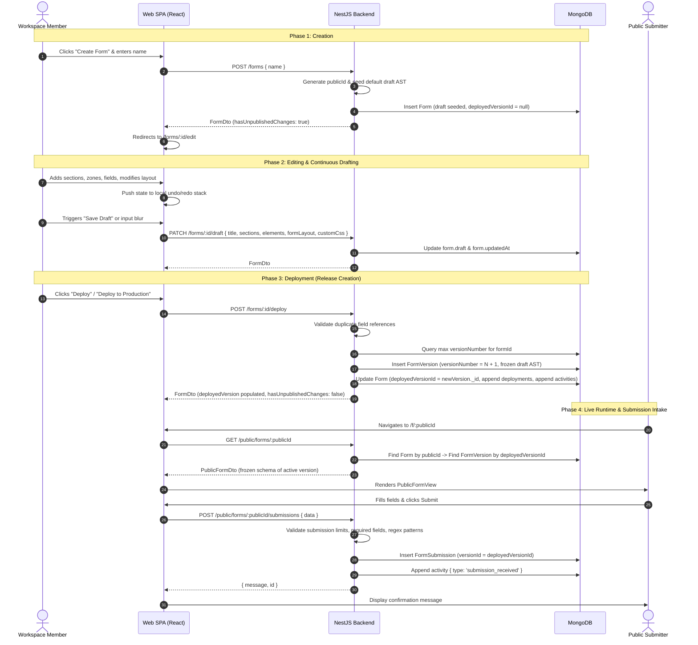

# Current Business Logic

## 1. System Business Model

The application is a full-stack SaaS form building, version deployment, and submission intake platform architected as a pnpm monorepo. It implements a strict **multi-tenant, single-user ownership, single-draft, and immutable version deployment** business model.

### 1.1 Multi-Tenant User Isolation
* The system defines two user roles: `Role.ADMIN` and `Role.USER` ([`packages/shared/src/index.ts`](file:///home/sct/dd/multi-tenant-form-builder/packages/shared/src/index.ts)).
* Standard users register through the public registration portal ([`apps/api/src/auth/auth.service.ts`](file:///home/sct/dd/multi-tenant-form-builder/apps/api/src/auth/auth.service.ts)) and are strictly provisioned with `Role.USER` and `UserStatus.ACTIVE`.
* Form ownership is strictly bound to the creating user (`userId: Types.ObjectId`). All form operations (retrieval, drafting, deployment, configuration, submission inspection) are scoped to the authenticated user's ID. There is no cross-tenant organization or team sharing layer implemented.
* Platform administrators operate in a separate administrative domain ([`apps/api/src/admin/admin.controller.ts`](file:///home/sct/dd/multi-tenant-form-builder/apps/api/src/admin/admin.controller.ts)) to monitor platform metrics and moderate user access (suspending and reactivating accounts).

### 1.2 Form Lifecycle & Architectural Invariant
The platform strictly enforces the **Single Form / Single Mutable Draft / Immutable Version Snapshot / Decoupled Runtime** invariant:
1. **Single Mutable Working Draft**: Each form has exactly one editable draft state stored directly inside the `Form` document (`Form.draft` in [`apps/api/src/forms/schemas/form.schema.ts`](file:///home/sct/dd/multi-tenant-form-builder/apps/api/src/forms/schemas/form.schema.ts)). Changes in the visual form builder mutate this draft document. There is no concept of branching drafts or concurrent draft copies.
2. **Immutable Snapshot Releases**: Deploying a draft freezes the schema into an immutable record in the `FormVersion` collection with an incremental integer `versionNumber` (`1, 2, 3...`).
3. **Decoupled Public Runtime**: The public-facing runtime at `/f/:publicId` ([`apps/web/src/features/forms/PublicFormPage.tsx`](file:///home/sct/dd/multi-tenant-form-builder/apps/web/src/features/forms/PublicFormPage.tsx)) is completely decoupled from the form editor. It serves only the snapshot referenced by `Form.deployedVersionId`. Ongoing draft modifications never alter the live public form until a deployment operation occurs.
4. **Permanent Version-Bound Submissions**: Every incoming public response is saved in the `FormSubmission` collection, permanently tagged with the active `versionId`.
5. **Unified Cumulative Data Sheet**: The form submissions view ([`apps/api/src/forms/forms.service.ts#getDataView`](file:///home/sct/dd/multi-tenant-form-builder/apps/api/src/forms/forms.service.ts#L871-L982)) compiles all responses across all historical versions into a single spreadsheet-like matrix, dynamically projecting every column ever defined.

---

## 2. Core Entities

### 2.1 User Entity
* **Source of Truth**: [`apps/api/src/users/schemas/user.schema.ts`](file:///home/sct/dd/multi-tenant-form-builder/apps/api/src/users/schemas/user.schema.ts)
* **Purpose**: Represents tenant users and platform administrators.
* **Fields**:
  * `id` / `_id`: Unique MongoDB ObjectId identifier.
  * `name`: String, required, trimmed user full name.
  * `email`: String, required, unique, lowercase, trimmed, indexed.
  * `passwordHash`: String, bcrypt password hash (salt rounds: 10). Excluded from `.toJSON()` transforms.
  * `role`: Enum (`Role.ADMIN` | `Role.USER`), defaults to `Role.USER`.
  * `status`: Enum (`UserStatus.ACTIVE` | `UserStatus.SUSPENDED`), defaults to `UserStatus.ACTIVE`.
  * `createdAt`, `updatedAt`: Timestamps managed by Mongoose.
* **Relationships**:
  * One-to-Many with `Form`: `User` is referenced by `Form.userId`.
* **Mutable State**:
  * `name`, `status` (via admin suspension/unsuspension).
* **Immutable State**:
  * `_id`, `role` (no API endpoint allows changing roles; admin is seeded via [`apps/api/src/seed.ts`](file:///home/sct/dd/multi-tenant-form-builder/apps/api/src/seed.ts)).
* **Business Constraints**:
  * Email must be globally unique.
  * An administrator account cannot be suspended.
  * An administrator cannot suspend their own account.
  * Suspended users are immediately blocked by `ActiveUserGuard` (403 Forbidden with `code: 'ACCOUNT_SUSPENDED'`) and have their active browser session revoked via WebSocket push.

### 2.2 Form Entity
* **Source of Truth**: [`apps/api/src/forms/schemas/form.schema.ts`](file:///home/sct/dd/multi-tenant-form-builder/apps/api/src/forms/schemas/form.schema.ts)
* **Purpose**: Primary container for form metadata, the current editable draft, configuration settings, deployment audit logs, and activity events.
* **Fields**:
  * `id` / `_id`: Unique MongoDB ObjectId identifier.
  * `name`: String, required, trimmed display name.
  * `userId`: ObjectId referencing `User`, required, indexed.
  * `publicId`: String, required, unique, indexed. Format: `f_${randomBytes(6).toString('hex')}` (14 characters total).
  * `deployedVersionId`: ObjectId referencing `FormVersion`, nullable, defaults to `null`. Points to the active live version.
  * `draft`: Embedded object storing the current working draft:
    * `title`: String.
    * `elements`: Array of `FormElement`.
    * `sections`: Array of `FormSection`.
    * `formLayout`: String (`'row' | 'column'`).
    * `customCss`: String containing custom CSS styling rules.
    * `updatedAt`: Date of last draft mutation.
  * `settings`: Embedded configuration dictionary:
    * `submissionLimit`: Number | null (defaults to `null`).
    * `allowMultipleSubmissions`: Boolean (defaults to `true`).
    * `successMessage`: String (defaults to `'Thank you! Your response has been submitted successfully.'`).
    * `redirectUrl`: String (defaults to `''`).
    * `closedMessage`: String (defaults to `'This form is currently closed and not accepting new responses.'`).
    * `isAcceptingSubmissions`: Boolean (defaults to `true`).
    * `notifyOnSubmission`: Boolean (defaults to `false`).
    * `notificationEmails`: Array of strings (defaults to `[]`).
    * `webhookUrl`: String (defaults to `''`).
  * `deployments`: Array of deployment log records:
    * `id`: String (`dep_${randomBytes(4).toString('hex')}`).
    * `formId`: String.
    * `versionId`: String.
    * `versionNumber`: Number.
    * `deployedAt`: ISO date string.
    * `deployedBy`: String (`'Workspace Member'`).
    * `isCurrent`: Boolean.
    * `notes`: String.
  * `activities`: Array of activity audit records:
    * `id`: String (`act_${randomBytes(4).toString('hex')}`).
    * `formId`: String.
    * `type`: `'form_created' | 'version_created' | 'version_deployed' | 'field_updated' | 'submission_received' | 'settings_updated'`.
    * `title`: String.
    * `description`: String.
    * `timestamp`: ISO date string.
    * `versionNumber`: Number (optional).
  * `createdAt`, `updatedAt`: Timestamps managed by Mongoose.
* **Relationships**:
  * Belongs to `User` via `userId`.
  * References currently active `FormVersion` via `deployedVersionId`.
  * One-to-Many with `FormVersion` (via `FormVersion.formId`).
  * One-to-Many with `FormSubmission` (via `FormSubmission.formId`).
* **Mutable State**:
  * `name`, `deployedVersionId`, `draft`, `settings`, `deployments`, `activities`, `updatedAt`.
* **Immutable State**:
  * `_id`, `userId`, `publicId`, `createdAt`.
* **Business Constraints**:
  * `publicId` is globally unique and immutable.
  * Forms can only be accessed and manipulated by the owning `userId`.

### 2.3 FormVersion Entity
* **Source of Truth**: [`apps/api/src/forms/schemas/form-version.schema.ts`](file:///home/sct/dd/multi-tenant-form-builder/apps/api/src/forms/schemas/form-version.schema.ts)
* **Purpose**: Immutable snapshot of a published form schema at a specific release number.
* **Fields**:
  * `id` / `_id`: Unique MongoDB ObjectId identifier.
  * `formId`: ObjectId referencing `Form`, required, indexed.
  * `versionNumber`: Number, required, incremental integer starting at 1.
  * `title`: String, required, trimmed version title.
  * `elements`: Array of `FormElement` (flattened AST list).
  * `sections`: Array of `FormSection` (hierarchical layout tree).
  * `formLayout`: String (`'row' | 'column'`), defaults to `'column'`.
  * `customCss`: String containing custom CSS rules at time of release.
  * `createdAt`, `updatedAt`: Timestamps managed by Mongoose.
* **Compound Index**:
  * `{ formId: 1, versionNumber: 1 }` with `{ unique: true }`.
* **Relationships**:
  * Belongs to `Form` via `formId`.
  * Referenced by `Form.deployedVersionId` when active.
  * One-to-Many with `FormSubmission` (via `FormSubmission.versionId`).
* **Mutable State**:
  * Completely immutable once created.
* **Immutable State**:
  * All fields. No endpoint in the application modifies existing `FormVersion` documents in MongoDB.

### 2.4 FormSubmission Entity
* **Source of Truth**: [`apps/api/src/forms/schemas/form-submission.schema.ts`](file:///home/sct/dd/multi-tenant-form-builder/apps/api/src/forms/schemas/form-submission.schema.ts)
* **Purpose**: Stores immutable response data submitted by visitors to the public form.
* **Fields**:
  * `id` / `_id`: Unique MongoDB ObjectId identifier.
  * `formId`: ObjectId referencing `Form`, required, indexed.
  * `versionId`: ObjectId referencing `FormVersion`, required, indexed.
  * `data`: Mixed object containing submitted key-value pairs (keyed by field reference and field ID).
  * `createdAt`, `updatedAt`: Timestamps managed by Mongoose.
* **Compound Index**:
  * `{ formId: 1, createdAt: -1 }`.
* **Relationships**:
  * Belongs to `Form` via `formId`.
  * Belongs to `FormVersion` via `versionId`.
* **Mutable State**:
  * None. Submissions are append-only.
* **Immutable State**:
  * All fields.

---

## 3. Application Lifecycle



### Detailed Lifecycle Steps:
1. **Creation**:
   * Invoked via `POST /forms` with `CreateFormDto` (`name: string`).
   * The backend generates a random `publicId` (`f_${randomBytes(6).toString('hex')}`).
   * The backend invokes `getRealisticDefaultForm(formName)` ([`packages/shared/src/types/form.ts#getRealisticDefaultForm`](file:///home/sct/dd/multi-tenant-form-builder/packages/shared/src/types/form.ts#L407-L582)), which constructs:
     * 2 default sections: "General Inputs" and "Options & Actions".
     * 3 default zones with desktop width presets (`'half'` and `'full'`).
     * 8 initial elements: Section Title, Description, Text Input (`sample_text`), Email Input (`email_address`), Numeric Field (`numeric_value`), Date Picker (`date_entry`), Dropdown (`selected_option`), Detailed Notes (`detailed_notes`), Checkbox (`confirmation_flag`), and Submit Button.
   * `Form.draft` is initialized with this AST. `deployedVersionId` is set to `null`.
   * An initial activity log (`form_created`) is saved.
   * The frontend navigates directly to the Form Editor (`/forms/:id/edit`).

2. **Editing**:
   * Occurs inside `FormEditorPage` ([`apps/web/src/features/forms/FormEditorPage.tsx`](file:///home/sct/dd/multi-tenant-form-builder/apps/web/src/features/forms/FormEditorPage.tsx)).
   * The current editable state is maintained in React state (`sections`, `formLayout`, `titleInput`, `customCss`) managed with a client-side undo/redo history hook (`useFormBuilderHistory`).
   * All field references are continuously checked for uniqueness via `checkDuplicateReferences(sections)`.

3. **Saving Draft**:
   * Triggered explicitly by clicking "Save Draft", automatically upon blurring the form title input, or before previewing/deploying.
   * Dispatches `PATCH /forms/:id/draft` with `UpdateDraftDto`.
   * Mutates `Form.draft` and updates `Form.updatedAt`.
   * **Does not create a version** and **does not affect public visitors**.

4. **Deployment**:
   * Dispatches `POST /forms/:id/deploy`.
   * Blocks if duplicate interactive field references exist (`checkDuplicateReferences`).
   * Fetches the latest `FormVersion` for this `formId` sorted by `versionNumber: -1`.
   * Computes `nextVersionNumber = (latestVersion?.versionNumber || 0) + 1`.
   * Creates and persists a new `FormVersion` snapshot.
   * Updates `Form.deployedVersionId = newVersion._id`.
   * Prepends a new record to `Form.deployments` with `isCurrent: true` and marks all previous deployment entries `isCurrent: false`.
   * Prepends a `version_deployed` entry to `Form.activities`.

5. **Live Usage**:
   * Public visitors request `GET /public/forms/:publicId`.
   * The backend resolves `Form.deployedVersionId`. If null, returns `{ isDeployed: false }`.
   * If deployed, retrieves the frozen `FormVersion` and returns `PublicFormDto`.
   * The frontend renders `PublicFormView`. Submissions hit `POST /public/forms/:publicId/submissions`.
   * Submissions are validated against the deployed version's constraints and written to `formsubmissions`.

---

## 4. Editor Business Logic

The Form Editor (`FormEditorPage`, `FormCanvasHierarchical`, `PropertiesPanel`) implements strict structural, validation, and layout rules.

### 4.1 Structural Hierarchy
* **Tree Constraint**: `Form` $\to$ `FormSection[]` $\to$ `FormZone[]` $\to$ `FormElement[]`.
* Form level controls the flow direction of sections (`formLayout: 'column' | 'row'`).
* Section level controls the flow direction of zones (`section.layout: 'row' | 'column'`).
* Zone level controls the flow direction of elements (`zone.layout: 'column' | 'row'`).

### 4.2 Sections
* Contain an array of `zones: FormZone[]`.
* Can have layout `'row'` (zones positioned side-by-side) or `'column'` (zones stacked vertically).
* Supports `columns?: 1 | 2 | 3 | 4` for multi-column grid partitioning.
* Supports horizontal alignment (`start`, `center`, `end`, `space-between`, `space-around`, `space-evenly`) and vertical alignment (`start`, `center`, `end`, `stretch`).
* Dimension constraints: `customWidth` (capped with `maxWidth: 100%` and `boxSizing: border-box`) and `customHeight`.
* Section deletion cascades to delete all child zones and elements.

### 4.3 Zones
* Contain an array of `elements: FormElement[]`.
* Responsive Width Model:
  * Widths are configured per viewport breakpoint: `desktop`, `tablet`, `mobile`.
  * Presets: `'full' (100%)`, `'three_quarters' (75%)`, `'two_thirds' (66.67%)`, `'half' (50%)`, `'one_third' (33.33%)`, `'one_quarter' (25%)`, `'custom' (10%-100%)`.
  * Row layout width compensation: When placed in a row section, widths are calculated using flex gap compensation:
    $$\text{calc}\left(\text{widthPercent}\% - \left(\text{var(--space-3)} \times \left(1 - \frac{\text{widthPercent}}{100}\right)\right)\right)$$
    This prevents multi-zone rows from wrapping unexpectedly.
* 3×3 Visual Flex Alignment Selector:
  * 9 alignment presets: `top-left`, `top-center`, `top-right`, `center-left`, `center`, `center-right`, `bottom-left`, `bottom-center`, `bottom-right`.
  * Resolved at runtime via `getZoneFlexStyles` ([`packages/shared/src/types/form.ts#getZoneFlexStyles`](file:///home/sct/dd/multi-tenant-form-builder/packages/shared/src/types/form.ts#L608-L674)) into appropriate CSS `justifyContent` and `alignItems` values depending on whether zone layout is `row` or `column`.
* Zone deletion cascades to delete all child elements.

### 4.4 Fields / Elements
* **Interactive Data Fields** (`isDataField === true`):
  * `text`, `email`, `number`, `phone`, `textarea`, `select`, `radio`, `checkbox`, `date`, `file`.
* **Interactive Action**:
  * `button` (`buttonAction: 'submit' | 'reset' | 'button'`).
* **Non-Interactive Elements**:
  * `title` (`headingLevel: 1 | 2 | 3`).
  * `description`.
  * `divider`.
  * `alert` (`alertVariant: 'info' | 'warning' | 'success'`).
  * `spacer`.

### 4.5 Field Ordering & Drag-and-Drop Movement
* Drag-and-drop handles sections, zones, and elements via native HTML5 drag events (`dragstart`, `dragover`, `drop`).
* Moving an element between zones or across sections **preserves 100% of its configuration, field ID, validation rules, and references** without modification ([`apps/web/src/features/forms/builder/FormCanvasHierarchical.tsx#handleMoveElement`](file:///home/sct/dd/multi-tenant-form-builder/apps/web/src/features/forms/builder/FormCanvasHierarchical.tsx#L130-L174)).
* Reordering elements within the same zone uses array index splicing.

### 4.6 Field Uniqueness & Reference Key Management
* Every data field has a `reference` key (used as database column identifier and payload key).
* When a user changes the field label in `PropertiesPanel`, the system automatically updates `element.name` and regenerates `element.reference` via `generateReference(label)` (unless manually locked via `isReferenceManual`).
* `generateReference` transforms text to lower-case, replaces non-alphanumeric characters with underscores, and trims leading/trailing underscores.
* In the background, `FormEditorPage.deduplicateReferences` continuously detects duplicate references and appends incremental suffixes (`_2`, `_3`).
* **Hard Enforcement**: Pre-deployment validation (`checkDuplicateReferences`) checks all interactive elements across the form. If duplicate references are detected:
  * The frontend disables the "Deploy" button and surfaces an error banner.
  * The backend `FormsService.deployDraft` throws `BadRequestException` ("Deployment blocked: duplicate field reference(s) found...").

### 4.7 Required & Validation Rules
* **Mandatory Toggle**: `element.required: boolean`.
* **Validation Sub-schema**:
  * `enabled: boolean`.
  * `pattern?: string` (regular expression string).
  * `errorMessage?: string`.
  * `successMessage?: string`.
  * `minLength?: number`, `maxLength?: number`.
  * `min?: number`, `max?: number`.
* Email fields automatically initialize with pattern `^[^\\s@]+@[^\\s@]+\\.[^\\s@]+$`.

### 4.8 Selection & Contextual Drawer Behavior
* Progressive drill-down selection logic:
  * Form $\to$ Section $\to$ Zone $\to$ Element.
  * If nothing or form is selected, clicking any element or zone first selects the parent `Section`.
  * Subsequent clicks drill down to `Zone`, and then to `Element`.
* The `PropertiesPanel` drawer is **closed by default** (`selection = null`).
* Clicking on the workspace background automatically deselects and closes the drawer.

---

## 5. Form Runtime Logic

The runtime is implemented across `PublicFormPage` ([`apps/web/src/features/forms/PublicFormPage.tsx`](file:///home/sct/dd/multi-tenant-form-builder/apps/web/src/features/forms/PublicFormPage.tsx)) and `PublicFormView` ([`apps/web/src/features/forms/public/PublicFormView.tsx`](file:///home/sct/dd/multi-tenant-form-builder/apps/web/src/features/forms/public/PublicFormView.tsx)).

### 5.1 Rendering & Styling
* The runtime renders the form based solely on the active `FormVersion` snapshot.
* Dynamic Scoped CSS:
  * Custom CSS specified in the version is parsed through `scopeCss` ([`apps/web/src/features/forms/builder/scopeCss.ts`](file:///home/sct/dd/multi-tenant-form-builder/apps/web/src/features/forms/builder/scopeCss.ts)).
  * All CSS rules are prepended with `.form-scope-${publicId}` and injected via an inline `<style>` tag, ensuring styles cannot leak into the surrounding application.
* Section titles, zone layouts, zone responsive widths, alignments, and field custom widths are applied using identical calculations as the editor.
* Submit Button Behavior:
  * If the form schema contains an explicit button with `buttonAction === 'submit'`, that button submits the form.
  * If no submit button is found in the schema, the runtime automatically injects a fallback "Submit Form" button at the bottom of the form.

### 5.2 Field Interpretation & State Management
* Field values are maintained in a React state dictionary (`formData: Record<string, any>`).
* Interactive components are rendered using `FieldElement` ([`apps/web/src/components/fields/FieldElement.tsx`](file:///home/sct/dd/multi-tenant-form-builder/apps/web/src/components/fields/FieldElement.tsx)).
* Inputs are bound to `fieldKey = element.reference || element.id`.

### 5.3 Client-Side Validation on Submit
Before dispatching a submission, `PublicFormPage.handleSubmit` executes validation across all data fields:
1. **Required Check**: Fails if value is `undefined`, `null`, `''`, or an empty array `[]`.
2. **Length Bounds**: Fails if string length $< \text{minLength}$ or $> \text{maxLength}$.
3. **Numeric Bounds**: If `type === 'number'`, validates that numeric value satisfies $\text{min} \le \text{val} \le \text{max}$.
4. **Regular Expression**: If `validation.pattern` is present, executes `new RegExp(pattern).test(String(val))`. Fails if false with `validation.errorMessage`.
5. If any validation fails, sets errors in `validationErrors` state, prevents network submission, and displays inline error messages.

### 5.4 Backend Validation & Submission Intake
When `POST /public/forms/:publicId/submissions` is received ([`apps/api/src/forms/forms.service.ts#submitPublicForm`](file:///home/sct/dd/multi-tenant-form-builder/apps/api/src/forms/forms.service.ts#L770-L868)):
1. Checks that form exists and `deployedVersionId` is not null (otherwise 400 Bad Request: "This form has not been deployed yet...").
2. Checks policy: `form.settings.isAcceptingSubmissions !== false` (otherwise 400 Bad Request with `settings.closedMessage`).
3. Checks policy: `form.settings.submissionLimit`. If defined and $> 0$, counts existing records in `formsubmissions`. If count $\ge$ limit, throws 400 Bad Request ("This form has reached its maximum submission limit").
4. Loads the deployed `FormVersion` document from MongoDB.
5. Iterates through all fields in `deployedVersion.elements`:
   * Enforces `required` check.
   * Enforces `validation.pattern` regex check.
6. Writes document to `FormSubmission` collection:
   ```typescript
   {
     formId: form._id,
     versionId: deployedVersion._id,
     data: dto.data || {}
   }
   ```
7. Appends a `submission_received` activity log to `Form.activities`.

---

## 6. Deployment & Version Lifecycle

### Explicit Answer to Directive
> **Is a deployment itself the creation of an application version?**
>
> **YES.** In the primary authoring lifecycle, **a deployment is the single business operation that creates an application version**. There is no separate "create version draft" business step. When a user deploys a form draft, the system freezes the current draft into a new `FormVersion` record with the next sequential version number (`N + 1`) and simultaneously designates it as the active production version (`Form.deployedVersionId = newVersion._id`).
>
> In addition to creating versions, deployment also supports **re-activating a previous version** (rollback). When rolling back, no new version record is generated; instead, `deployedVersionId` is updated to point to the historical `FormVersion`, and a new deployment audit log entry is recorded.

### 6.1 What Creates a Version
* A version is created **exclusively** when `FormsService.deployDraft` ([`apps/api/src/forms/forms.service.ts#L437-L522`](file:///home/sct/dd/multi-tenant-form-builder/apps/api/src/forms/forms.service.ts#L437-L522)) is executed (via `POST /forms/:id/deploy`).
* It captures the current content of `Form.draft`:
  * `title`: Draft title or form name.
  * `elements`: Flattened array of all elements across all sections and zones.
  * `sections`: Complete hierarchical section/zone tree.
  * `formLayout`: Form arrangement (`'row' | 'column'`).
  * `customCss`: Scoped CSS styles.
  * `versionNumber`: Incremental integer computed as `(latestVersion?.versionNumber || 0) + 1`.

### 6.2 Selection of the Live Version
* The live version is determined strictly by the `Form.deployedVersionId` field in MongoDB.
* The public runtime query executes:
  ```typescript
  const form = await this.formModel.findOne({ publicId });
  const deployedVersion = await this.formVersionModel.findById(form.deployedVersionId);
  ```
* If `deployedVersionId` is null, the form is considered unpublished.

### 6.3 Handling of Previous Live Versions
* When a new version is deployed or an old version is re-activated:
  * The previous live version remains **permanently preserved and untouched** in the `form_versions` collection.
  * In `Form.deployments`, previous deployment entries have their `isCurrent` flag updated to `false`.
  * The new deployment is prepended to `Form.deployments` with `isCurrent: true`.
  * Historical submissions retain their permanent link to their original `versionId`.

### 6.4 Independence of Draft vs. Live Application
* Subsequent edits to `Form.draft` in the Form Builder **have zero effect on the live application**.
* `hasUnpublishedChanges` is dynamically calculated:
  * If `deployedVersionId === null` $\to$ `true`.
  * If `draft.title !== deployedVersion.title || draft.formLayout !== deployedVersion.formLayout || draft.customCss !== deployedVersion.customCss || JSON.stringify(draft.sections) !== JSON.stringify(deployedVersion.sections)` $\to$ `true`.
  * Otherwise $\to$ `false`.

### 6.5 Draft Multiplicity & Version Immutability
* **Multiple drafts cannot exist**: Only a single draft object is stored in `Form.draft`.
* **Version history is immutable**: Once written, `FormVersion` records are never updated or deleted.

---

## 7. User / Tenant / Permission Logic

### 7.1 Roles and Statuses
* **Roles**:
  * `Role.USER`: Standard SaaS customer. Can create, edit, deploy, and delete their own forms, and view their submissions.
  * `Role.ADMIN`: System administrator. Has full access to admin metrics and user moderation.
* **Statuses**:
  * `UserStatus.ACTIVE`: Account is in good standing.
  * `UserStatus.SUSPENDED`: Account is suspended.

### 7.2 Access Control Matrix

| Resource / Action | Endpoint | Role Allowed | Status Allowed | Ownership Rule |
|---|---|---|---|---|
| Register Account | `POST /auth/register` | Public | Any | Creates standard `USER`, `ACTIVE` |
| Login | `POST /auth/login` | Public | `ACTIVE` only (suspended users rejected at login) | Verified by bcrypt |
| List Admin Stats | `GET /dashboard/admin` | `ADMIN` | `ACTIVE` | System-wide statistics |
| List All Users | `GET /admin/users` | `ADMIN` | `ACTIVE` | System-wide user list |
| Suspend User | `PATCH /admin/users/:id/suspend` | `ADMIN` | `ACTIVE` | Cannot suspend Admin or self |
| Unsuspend User | `PATCH /admin/users/:id/unsuspend` | `ADMIN` | `ACTIVE` | Any suspended user |
| Create Form | `POST /forms` | `USER` | `ACTIVE` | Form owned by caller `userId` |
| List User's Forms | `GET /forms` | `USER` | `ACTIVE` | Filtered by `userId` |
| Get Single Form | `GET /forms/:id` | `USER` | `ACTIVE` | `form.userId === user.id` required |
| Update Draft | `PATCH /forms/:id/draft` | `USER` | `ACTIVE` | `form.userId === user.id` required |
| Deploy Draft | `POST /forms/:id/deploy` | `USER` | `ACTIVE` | `form.userId === user.id` required |
| Update Settings | `PATCH /forms/:id/settings` | `USER` | `ACTIVE` | `form.userId === user.id` required |
| View Submissions | `GET /forms/:id/data` | `USER` | `ACTIVE` | `form.userId === user.id` required |
| Re-activate Version | `POST /forms/:id/versions/:vId/deploy` | `USER` | `ACTIVE` | `form.userId === user.id` required |
| View Public Form | `GET /public/forms/:publicId` | Public | Any | Unauthenticated |
| Submit Public Form | `POST /public/forms/:publicId/submissions` | Public | Any | Unauthenticated (gated by form settings) |

### 7.3 Real-Time Session Invalidation
When an Administrator calls `PATCH /admin/users/:id/suspend`:
1. The backend updates `user.status = UserStatus.SUSPENDED`.
2. The backend invokes `EventsGateway.emitUserSuspended(id)` ([`apps/api/src/websocket/events.gateway.ts`](file:///home/sct/dd/multi-tenant-form-builder/apps/api/src/websocket/events.gateway.ts)), broadcasting the `user:suspended` event to WebSocket room `user:${id}`.
3. The target user's active client ([`apps/web/src/app/providers/SocketProvider.tsx`](file:///home/sct/dd/multi-tenant-form-builder/apps/web/src/app/providers/SocketProvider.tsx)) intercepts the event, purges authentication tokens from `localStorage`, disconnects the socket, and forces navigation to `/account-suspended`.
4. Any in-flight or subsequent HTTP request from the suspended user is intercepted by `ActiveUserGuard` ([`apps/api/src/common/guards/active-user.guard.ts`](file:///home/sct/dd/multi-tenant-form-builder/apps/api/src/common/guards/active-user.guard.ts)), which immediately aborts with `403 Forbidden` (`ACCOUNT_SUSPENDED`).

---

## 8. Data Lifecycle

### 8.1 Database Collections
* `users`: Stores user credentials, role, and active status.
* `forms`: Stores form metadata, single mutable draft, settings, deployments log, and activity history.
* `formversions`: Stores immutable release snapshots.
* `formsubmissions`: Stores submitted responses.

### 8.2 Entity Relationships
```text
User (1) ───< Form (*)
               │ (1)
               ├───< FormVersion (*)  <───┐
               │                          │ (1)
               ├───< FormSubmission (*) ──┘
```

### 8.3 Deletion Behavior & Historical Data Preservation
* **When fields/zones/sections are deleted in the Editor**:
  * They are removed **only from `Form.draft`**.
  * Existing `FormVersion` records are immutable and retain the deleted elements.
  * Existing `FormSubmission` records retain all submitted data under their original keys.
* **Data Sheet Column Accumulation** (`FormsService.getDataView` in [`apps/api/src/forms/forms.service.ts#L871-L982`](file:///home/sct/dd/multi-tenant-form-builder/apps/api/src/forms/forms.service.ts#L871-L982)):
  * To render the submissions table, the backend queries **all historical `FormVersion` records ever deployed** for that form.
  * It accumulates a master list of columns (`columnsMap`), ensuring that even if a field was deleted in Version 3, its column still appears for submissions received under Versions 1 and 2.
  * In addition, any extra fields found in raw submission JSON that were not in any schema are dynamically added as fallback text columns.
  * For submissions collected under a version that did not contain a given field, the cell value is returned as empty string `""` and rendered in the UI as `(empty)` or `—`.
  * **Result**: Historical data is never lost or orphaned when form schemas are edited.

---

## 9. Current Business Options

The application presents two primary business options / operational features for managing form releases and history:

```text
                                  Form Management
                                         │
                 ┌───────────────────────┴───────────────────────┐
                 ▼                                               ▼
         [Option 1: Versions]                           [Option 2: Deployments]
         (Schema & Draft Lifecycle)                     (Release Audit & Rollback)
                 │                                               │
   ┌─────────────┴─────────────┐                                 │
   ▼                           ▼                                 ▼
Deploy Draft              Re-activate Historical            Rollback to
(Creates Version N+1)     Version Snapshot                  Previous Release
   │                           │                                 │
   ▼                           └────────────────┬────────────────┘
FormVersion.create()                            ▼
Form.deployedVersionId = newId          Form.deployedVersionId = existingVersionId
Form.deployments.push()                 Form.deployments.push()
```

---

### Option 1: "Versions" Management (Draft & Snapshot Lifecycle)

* **Purpose**: Manages the continuous drafting process, schema comparison (diffing), and the creation of immutable release snapshots.
* **Entry Point**: Form Detail Page $\to$ **Versions** Tab ([`apps/web/src/features/forms/detail/sections/VersionsSection.tsx`](file:///home/sct/dd/multi-tenant-form-builder/apps/web/src/features/forms/detail/sections/VersionsSection.tsx)) or the Form Editor header.
* **Business Flow**:
  1. The user inspects the "Current Working Draft" card, observing whether unpublished changes exist compared to production.
  2. The user can click "Compare Versions" ([`VersionComparisonModal.tsx`](file:///home/sct/dd/multi-tenant-form-builder/apps/web/src/features/forms/detail/sections/VersionComparisonModal.tsx)) to inspect field-by-field differences (Added, Removed, Modified, Identical) between the draft or any version and the live production version.
  3. The user can preview any historical version snapshot in a dedicated preview tab (`/forms/:id/preview?version=:versionId`).
  4. The user deploys the draft by clicking "Deploy to Production" (`POST /forms/:id/deploy`).
  5. The user can re-activate a historical version by clicking "Re-activate" (`POST /forms/:id/versions/:versionId/deploy`).
* **Data Involved**: `Form.draft`, `FormVersion`, `Form.deployedVersionId`, `Form.activities`.
* **Validation**: Pre-deployment uniqueness validation (`checkDuplicateReferences`) blocks deployment if duplicate field references exist.
* **Persistence**: Inserts a new document into `form_versions` with `versionNumber = N + 1`, updates `Form.deployedVersionId`, and appends an entry to `Form.deployments`.
* **Deployment Behavior**: Generates a new frozen version snapshot and sets it as live.
* **Runtime Behavior**: The public endpoint `/f/:publicId` immediately begins serving the newly created `FormVersion`.

---

### Option 2: "Deployments" Management (Release Audit & Rollback)

* **Purpose**: Provides a chronological, audit-logged history of production deployments with single-click verification and release rollback.
* **Entry Point**: Form Detail Page $\to$ **Deployments** Tab ([`apps/web/src/features/forms/detail/sections/DeploymentsSection.tsx`](file:///home/sct/dd/multi-tenant-form-builder/apps/web/src/features/forms/detail/sections/DeploymentsSection.tsx)).
* **Business Flow**:
  1. The user views the chronological list of production releases stored in `Form.deployments`.
  2. The active production release is highlighted with a `CURRENT PRODUCTION` badge and includes a "Test Live Form" action.
  3. Historical releases are flagged as `SUPERSEDED` and display deployment timestamps, deployer metadata ("Workspace Member"), and deployment notes.
  4. For any superseded release, the user can click "Rollback to v{N}".
  5. A confirmation dialog appears explaining that public visitors will immediately see the selected version's schema and subsequent submissions will be tagged with that version.
  6. On confirmation, dispatches `POST /forms/:id/versions/:versionId/deploy`.
* **Data Involved**: `Form.deployments`, `Form.deployedVersionId`, `Form.activities`.
* **Validation**: Validates that `formId` and `versionId` exist and belong to the authenticated user.
* **Persistence**: Does **not** create a new `FormVersion`. Updates `Form.deployedVersionId = targetVersion._id`, prepends a new deployment record to `Form.deployments` (`notes: 'Re-activated Version N for production'`), and prepends an activity record to `Form.activities`.
* **Deployment Behavior**: Switches the active deployment pointer to an existing historical version without creating new schema records or modifying `Form.draft`.
* **Runtime Behavior**: Immediately switches `/f/:publicId` to serve the rolled-back version's schema. Future submissions link to that historical `versionId`.

---

### Underlying Business Model Comparison
Both Option 1 and Option 2 **use the exact same underlying business model**:
* Both resolve the live public form using `Form.deployedVersionId`.
* When Option 1 re-activates a version, it calls the exact same backend service method (`formsService.deployVersion`) as Option 2's rollback button.
* Option 1 focuses on **schema drafting and new snapshot creation**, while Option 2 focuses on **release history auditing and deployment pointer rollback**.

---

## 10. Business Rules Inventory

| Rule | Current Behavior | Enforcement Location | Status |
|---|---|---|---|
| **User Authentication** | All private routes require a valid JWT Bearer token in the `Authorization` header. | Backend (`JwtAuthGuard`) & Frontend (`ProtectedRoute`) | Implemented |
| **Account Suspension Check** | Suspended accounts receive `403 Forbidden` (`ACCOUNT_SUSPENDED`) on all authenticated endpoints. | Backend (`ActiveUserGuard`) | Implemented |
| **Real-Time Session Revocation** | When suspended by an admin, the user's active session is terminated instantly via WebSocket push. | Backend (`EventsGateway`) & Frontend (`SocketProvider`) | Implemented |
| **Admin Self-Suspension Block** | An administrator cannot suspend their own account or another administrator account. | Backend (`AdminService.suspendUser`) | Implemented |
| **Tenant Isolation** | Users can only access, modify, deploy, or view submissions for forms where `form.userId === user.id`. | Backend (`FormsService`) | Implemented |
| **Single Mutable Draft** | Each form has exactly one editable draft stored in `Form.draft`. Autosaving updates this draft without creating versions. | Backend (`FormsService.updateDraft`) & Database | Implemented |
| **Draft / Production Independence** | Editing a draft does not alter the live form at `/f/:publicId` until explicitly deployed. | Backend (`FormsService.getPublicForm`) & Frontend | Implemented |
| **Duplicate Reference Block** | Deployment is blocked if duplicate field references exist across any interactive fields. | Frontend (`FormEditorPage`) & Backend (`FormsService.deployDraft`) | Implemented |
| **Sequential Version Numbering** | Versions increment monotonically (`1, 2, 3...`) per form. | Backend (`FormsService.deployDraft`) & Database compound index | Implemented |
| **Version Immutability** | Published `FormVersion` records are frozen and cannot be updated. | Backend (`FormsService`) & Database schema | Implemented |
| **Submission Integrity** | Submissions permanently link to the `versionId` deployed at time of submission. | Backend (`FormsService.submitPublicForm`) | Implemented |
| **Form Submission Limit** | Submissions are rejected if `form.settings.submissionLimit` is reached. | Backend (`FormsService.submitPublicForm`) | Implemented |
| **Accepting Submissions Policy** | Submissions are rejected with `closedMessage` if `isAcceptingSubmissions === false`. | Backend (`FormsService.submitPublicForm`) | Implemented |
| **Field Validation (Required)** | Required fields must not be empty/null on submission. | Frontend (`PublicFormPage`) & Backend (`FormsService.submitPublicForm`) | Implemented |
| **Field Validation (Regex)** | If `validation.pattern` is set, values must match the pattern. | Frontend (`PublicFormPage`) & Backend (`FormsService.submitPublicForm`) | Implemented |
| **Historical Column Preservation** | The data view retains columns for all fields ever defined across any version, showing `(empty)` for versions without that field. | Backend (`FormsService.getDataView`) & Frontend (`FormDataPage`) | Implemented |
| **Max-Width Overflow Protection** | Custom width inputs are constrained with `maxWidth: 100%` and `boxSizing: border-box`. | Frontend (`PropertiesPanel`, `FormCanvasHierarchical`, `PublicFormView`) | Implemented |
| **Admin Route Protection** | Routes under `/admin` require `Role.ADMIN`. | Backend (`RolesGuard`) & Frontend (`AdminRoute`) | Implemented |
| **CSV Submission Export** | Submissions exported to CSV file via browser blob download. | Frontend only (`DataSection.tsx#handleExportCSV`) | Implemented (Client-side) |

---

## 11. Actual State Model

### 11.1 User Account State Model

```text
                  Register (POST /auth/register)
                             │
                             ▼
                    ┌─────────────────┐
                    │   User: ACTIVE  │◄──────────────┐
                    └────────┬────────┘               │
                             │                        │
               Admin Action  │                        │ Admin Action
     PATCH /admin/users/:id/ │                        │ PATCH /admin/users/:id/
                     suspend │                        │ unsuspend
                             ▼                        │
                    ┌─────────────────┐               │
                    │ User: SUSPENDED ├───────────────┘
                    └─────────────────┘
                     (Session Revoked via WS,
                      ActiveUserGuard 403)
```

### 11.2 Form & Version State Model

```text
                     Create Form (POST /forms)
                                │
                                ▼
                    ┌───────────────────────┐
                    │   Form Created        │
                    │ (Initial draft seeded)│
                    └───────────┬───────────┘
                                │
                                ▼
                    ┌───────────────────────┐
           ┌───────►│  Single Working Draft │◄──────┐
           │        │     (Form.draft)      │       │
           │        └───────────┬───────────┘       │
           │ Save Draft         │ Deploy Draft      │
           │ (PATCH .../draft)  │ (POST .../deploy) │ Continue
           └────────────────────┤                   │ Editing
                                ▼                   │
                    ┌───────────────────────┐       │
                    │   New FormVersion     │       │
                    │  (Version N+1 frozen) │───────┘
                    └───────────┬───────────┘
                                │
                                ▼
                    ┌───────────────────────┐
                    │ Active Live Version   │◄────────────────┐
                    │ (deployedVersionId)   │                 │
                    └───────────┬───────────┘                 │
                                │                             │
                 Subsequent     │ Re-activate / Rollback      │
                 Deployment     │ (POST .../versions/:id/deploy)
                                ▼                             │
                    ┌───────────────────────┐                 │
                    │ Superseded Versions   ├─────────────────┘
                    │ (Immutable in DB)     │
                    └───────────────────────┘
```

### 11.3 Public Submission Intake State Model

```text
               Public Visitor arrives at /f/:publicId
                                │
                                ▼
                     Is deployedVersionId set?
                                │
                    ┌───────────┴───────────┐
                 No │                   Yes │
                    ▼                       ▼
            Display "Not Deployed"    Load FormVersion
            Reject Submissions        Render PublicFormView
                                            │
                                            ▼
                                  Submit Button Clicked
                                            │
                                            ▼
                                  Client Validation Passed?
                                            │
                                ┌───────────┴───────────┐
                             No │                   Yes │
                                ▼                       ▼
                        Display Inline Errors     POST .../submissions
                                                        │
                                                        ▼
                                              Backend Checks:
                                              1. isAcceptingSubmissions
                                              2. submissionLimit
                                              3. required & regex fields
                                                        │
                                            ┌───────────┴───────────┐
                                         No │                   Yes │
                                            ▼                       ▼
                                    400 Bad Request         Insert FormSubmission
                                    Display Error Banner    Append Activity
                                                            Show "Thank You"
```

---

## 12. Inconsistencies and Gaps

The following issues are demonstrably present in the latest codebase:

### 1. Version Compatibility Methods Mutate Draft Instead of Handling Versions
* **Current Behavior**:
  * In [`apps/api/src/forms/forms.service.ts#L604-L625`](file:///home/sct/dd/multi-tenant-form-builder/apps/api/src/forms/forms.service.ts#L604-L625), `updateVersion` does not update any `FormVersion` record in MongoDB. Instead, it calls `this.updateDraft(userId, formId, dto)` and returns a mock object with `id: 'draft'`.
  * In `createVersion` ([`apps/api/src/forms/forms.service.ts#L591-L601`](file:///home/sct/dd/multi-tenant-form-builder/apps/api/src/forms/forms.service.ts#L591-L601)), calling the endpoint updates the draft and immediately deploys it to production.
  * In `duplicateVersion` ([`apps/api/src/forms/forms.service.ts#L628-L677`](file:///home/sct/dd/multi-tenant-form-builder/apps/api/src/forms/forms.service.ts#L628-L677)), duplicating a version overwrites `form.draft` with the historical version's elements.
* **Evidence in Code**: [`apps/api/src/forms/forms.service.ts#L591-L677`](file:///home/sct/dd/multi-tenant-form-builder/apps/api/src/forms/forms.service.ts#L591-L677).
* **Business Impact**: Client applications or integrations attempting to use RESTful version modification find that operations either fail to mutate versions or overwrite the working draft.

### 2. Discrepancy in CSV Export Implementation
* **Current Behavior**:
  * Root documentation ([`README.md#L98`](file:///home/sct/dd/multi-tenant-form-builder/README.md#L98)) describes CSV export as a backend endpoint: `GET /forms/:id/data?format=csv`.
  * In reality, no `format=csv` handler exists in [`FormsController.getDataView`](file:///home/sct/dd/multi-tenant-form-builder/apps/api/src/forms/forms.controller.ts#L73-L79) or [`FormsService.getDataView`](file:///home/sct/dd/multi-tenant-form-builder/apps/api/src/forms/forms.service.ts#L871-L982).
  * CSV export is performed entirely on the client side inside [`DataSection.tsx#handleExportCSV`](file:///home/sct/dd/multi-tenant-form-builder/apps/web/src/features/forms/detail/sections/DataSection.tsx#L141-L168) by constructing a client-side Blob from the JSON data view.
* **Evidence in Code**: Compare [`README.md#L98`](file:///home/sct/dd/multi-tenant-form-builder/README.md#L98) with [`apps/api/src/forms/forms.controller.ts#L73-L79`](file:///home/sct/dd/multi-tenant-form-builder/apps/api/src/forms/forms.controller.ts#L73-L79) and [`apps/web/src/features/forms/detail/sections/DataSection.tsx#L141-L168`](file:///home/sct/dd/multi-tenant-form-builder/apps/web/src/features/forms/detail/sections/DataSection.tsx#L141-L168).
* **Business Impact**: External systems or automated pipelines cannot fetch CSV exports directly via HTTP API.

### 3. Deployments Stored as an Unstructured Embedded Array
* **Current Behavior**:
  * Deployments are stored as raw objects inside `form.deployments: any[]` on the `Form` document rather than a dedicated `form_deployments` collection.
  * In [`FormsService.findOne`](file:///home/sct/dd/multi-tenant-form-builder/apps/api/src/forms/forms.service.ts#L271-L284), if `form.deployments` is empty but a `deployedVersion` exists, the backend dynamically manufactures a synthetic deployment object (`dep_${deployedVersion.id}`) on the fly.
* **Evidence in Code**: [`apps/api/src/forms/schemas/form.schema.ts#L49-L50`](file:///home/sct/dd/multi-tenant-form-builder/apps/api/src/forms/schemas/form.schema.ts#L49-L50) and [`apps/api/src/forms/forms.service.ts#L271-L284`](file:///home/sct/dd/multi-tenant-form-builder/apps/api/src/forms/forms.service.ts#L271-L284).
* **Business Impact**: High deployment counts increase document size on the `Form` entity; deployment entries lack schema-level validation.

### 4. Dead / Inactive Prisma Artifact
* **Current Behavior**:
  * An inactive Prisma schema file remains at [`apps/api/prisma/schema.prisma`](file:///home/sct/dd/multi-tenant-form-builder/apps/api/prisma/schema.prisma).
  * It defines PostgreSQL models (`User`, `Form`, `FormVersion`, `FormSubmission`).
  * However, Prisma is not initialized, generated, or imported anywhere in `apps/api/src`. The active datastore is strictly MongoDB via Mongoose.
* **Evidence in Code**: [`apps/api/prisma/schema.prisma`](file:///home/sct/dd/multi-tenant-form-builder/apps/api/prisma/schema.prisma) and [`docs/source-of-truth.md#L27-L29`](file:///home/sct/dd/multi-tenant-form-builder/docs/source-of-truth.md#L27-L29).
* **Business Impact**: Contributor confusion regarding the active persistence engine and database migration tooling.

### 5. Absence of Submission Purge / Deletion Mechanism
* **Current Behavior**:
  * There are no endpoints or UI controls for deleting or archiving submissions, either individually or in bulk.
  * Submissions remain in `formsubmissions` permanently unless removed directly via direct database manipulation.
* **Evidence in Code**: Absence of any `DELETE` endpoints in [`apps/api/src/forms/forms.controller.ts`](file:///home/sct/dd/multi-tenant-form-builder/apps/api/src/forms/forms.controller.ts).
* **Business Impact**: Users cannot comply with data deletion or privacy removal requests (e.g. GDPR right-to-be-forgotten) via application workflows.
