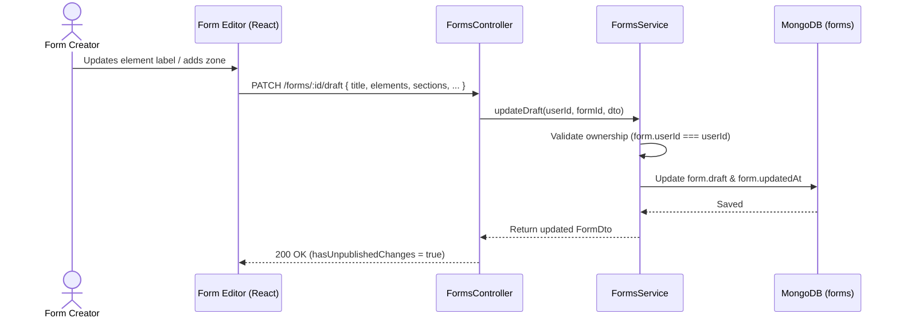
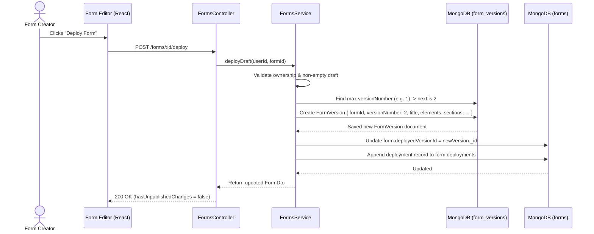
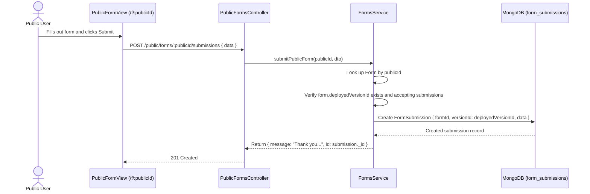

# Architecture: Data Flow

> **Scope**: End-to-end data flows for Form Autosaving, Version Deployment, and Public Submissions.  
> **Source of Truth**: [`apps/api/src/forms/forms.service.ts`](file:///c:/Users/Muhammed%20Jasim/machine-test/apps/api/src/forms/forms.service.ts) and [`apps/web/src/features/forms/`](file:///c:/Users/Muhammed%20Jasim/machine-test/apps/web/src/features/forms/).  
> **Last Verified**: 2026-09-24

---

## 1. Continuous Draft Autosaving Flow

---

## 2. Release Deployment & Version Snapshotting Flow

---

## 3. Public Form Submission Flow

