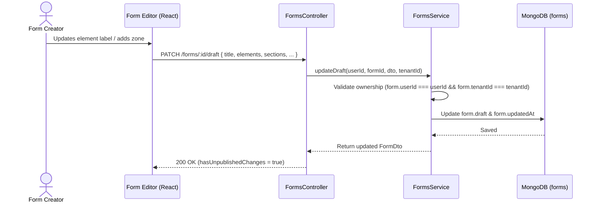
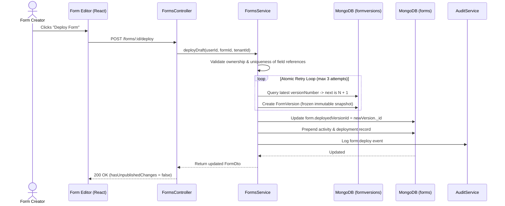
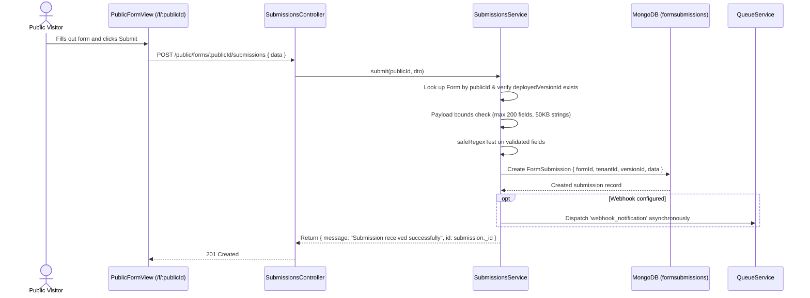

# Architecture: Data Flow

> **Scope**: End-to-end data flows for Form Autosaving, Version Deployment, and Public Submissions.  
> **Source of Truth**: Implementation across `apps/api/src/forms/`, `apps/api/src/submissions/`, and `apps/web/src/features/forms/`.  
> **Last Verified**: 2026-09-25

---

## 1. Continuous Draft Autosaving Flow

---

## 2. Release Deployment & Concurrency-Safe Snapshotting Flow

---

## 3. Public Form Submission Flow

