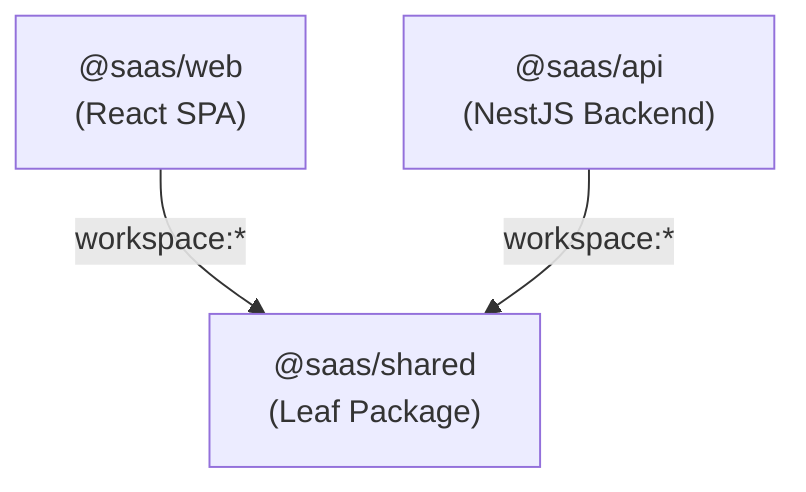

# Architecture: Dependencies & Package Graph

> **Scope**: Dependency graph across monorepo workspaces and external libraries.  
> **Source of Truth**: `package.json` in root and apps/packages subdirectories.  
> **Last Verified**: 2026-09-24

---

## 1. Internal Monorepo Dependency Graph

* **`@saas/shared`**: Independent leaf package containing TypeScript types, DTOs, enums, and AST models. No internal dependencies.
* **`@saas/web`**: Depends on `@saas/shared`.
* **`@saas/api`**: Depends on `@saas/shared`.

---

## 2. Key External Dependencies

### Backend (`apps/api`)
- `@nestjs/core`, `@nestjs/common`, `@nestjs/platform-express`: NestJS framework.
- `@nestjs/mongoose`, `mongoose`: MongoDB Object Document Mapper.
- `@nestjs/jwt`, `@nestjs/passport`, `passport-jwt`: JWT authentication.
- `bcryptjs`: Password hashing.
- `class-validator`, `class-transformer`: Request DTO validation.
- `@nestjs/websockets`, `@nestjs/platform-socket.io`, `socket.io`: Real-time WebSocket broadcasting.

### Frontend (`apps/web`)
- `react`, `react-dom` (v19): Component UI library.
- `react-router-dom` (v7): Client routing and history navigation.
- `socket.io-client` (v4): WebSocket client for real-time suspension traps.
- `sass` (v1): SCSS compilation for design token styles.
- `vite` (v6): Fast bundler and development server.
