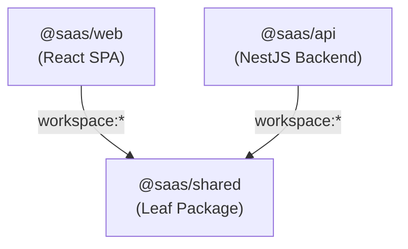

# Architecture: Dependencies & Package Graph

> **Scope**: Dependency graph across monorepo workspaces and external libraries.  
> **Source of Truth**: `package.json` files across root, `apps/`, and `packages/`.  
> **Last Verified**: 2026-09-25

---

## 1. Internal Monorepo Dependency Graph

* **`@saas/shared`**: Independent leaf package containing canonical TypeScript types, DTOs, enums (`Role`, `UserStatus`, `Permission`), and AST models. Never imports from `apps/`.
* **`@saas/web`**: Single-page application consuming `@saas/shared`.
* **`@saas/api`**: NestJS modular monolith consuming `@saas/shared`.

---

## 2. Key External Dependencies

### Backend (`apps/api`)
- `@nestjs/core`, `@nestjs/common`, `@nestjs/platform-express`: NestJS framework.
- `@nestjs/mongoose`, `mongoose`: MongoDB Object Document Mapper.
- `@nestjs/jwt`, `@nestjs/passport`, `passport-jwt`: JWT authentication.
- `@nestjs/throttler`: Application-layer rate limiting.
- `@socket.io/redis-adapter`, `ioredis`: Real-time Redis pub/sub cluster adapter.
- `helmet`: HTTP security headers.
- `bcryptjs`: Cryptographic password hashing.
- `class-validator`, `class-transformer`: Request DTO validation and transformation.
- `@nestjs/websockets`, `@nestjs/platform-socket.io`, `socket.io`: Real-time WebSocket broadcasting.

### Frontend (`apps/web`)
- `react`, `react-dom` (v19): Component UI library.
- `react-router-dom` (v7): Client routing and history navigation.
- `socket.io-client` (v4): WebSocket client for real-time suspension traps.
- `sass` (v1): SCSS compilation for design token styles.
- `vite` (v6): Bundler and development server.
