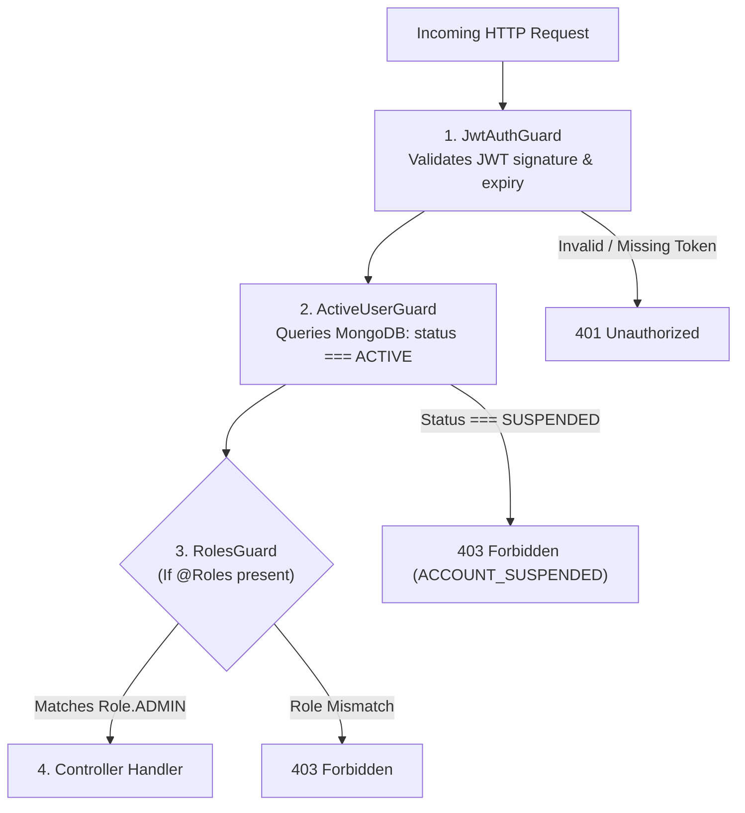

# Architecture: Security Model

> **Scope**: Security boundaries, guards pipeline, token lifecycle, and data isolation.  
> **Source of Truth**: [`apps/api/src/common/guards/`](file:///c:/Users/Muhammed%20Jasim/machine-test/apps/api/src/common/guards/) and [`apps/api/src/auth/`](file:///c:/Users/Muhammed%20Jasim/machine-test/apps/api/src/auth/).  
> **Last Verified**: 2026-09-24

---

## 1. Request Security & Authorization Pipeline

Every non-public HTTP request executes through a chained guard pipeline:



---

## 2. Data Isolation & Tenant Boundaries

* **User Scoping**: In `FormsService`, all CRUD methods (`findOne`, `updateDraft`, `deployDraft`, `deleteForm`, `getDataView`, `exportSubmissionsCsv`) check:
  ```typescript
  if (form.userId.toString() !== userId) {
    throw new ForbiddenException('You do not have access to this form');
  }
  ```
* **Public Boundary**: Public endpoints under `/public/forms/*` do not require authentication tokens, but strictly expose only published version schemas (`PublicFormDto`) and accept submission payloads (`SubmitFormDto`). Draft states and user metadata are never exposed publicly.
