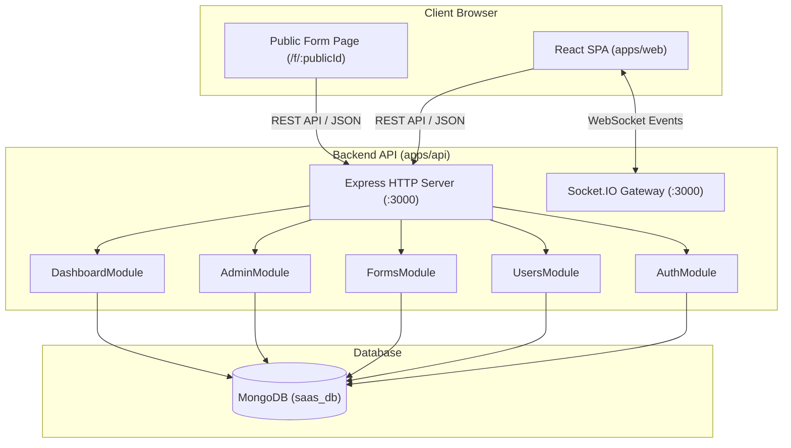

# Architecture: System Overview & Topology

> **Scope**: Application boundaries, structural modules, and communication channels.  
> **Source of Truth**: Monorepo package manifests and NestJS module imports in [`apps/api/src/app.module.ts`](file:///c:/Users/Muhammed%20Jasim/machine-test/apps/api/src/app.module.ts).  
> **Last Verified**: 2026-09-24

---

## 1. System Topology

---

## 2. Core Package Responsibilities

1. **`apps/web`**:
   - Single entry point SPA rendering workspace routes, admin console, form builder, and public forms.
   - Built with React 19, Vite 6, and React Router DOM 7.
2. **`apps/api`**:
   - NestJS 11 backend providing REST APIs and WebSocket server.
   - Handles authentication, role enforcement, validation, and database operations via Mongoose.
3. **`packages/shared`**:
   - Shared contract layer containing TypeScript interfaces, enums (`Role`, `UserStatus`), DTOs, and Form Schema AST types (`FormElement`, `FormSection`, `FormZone`).
