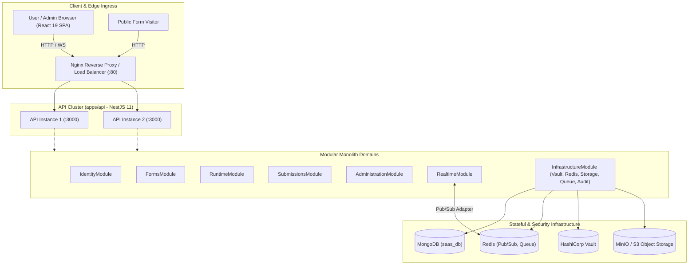

# Architecture: System Overview & Modular Monolith Topology

> **Scope**: Application boundaries, structural modules, and communication channels.  
> **Source of Truth**: Monorepo package manifests and NestJS module imports in [`apps/api/src/app.module.ts`](file:///home/sct/dd/multi-tenant-form-builder/apps/api/src/app.module.ts).  
> **Last Verified**: 2026-09-25

---

## 1. System Topology

---

## 2. Core Package Responsibilities

1. **`apps/web`**: Single-page application built with React 19, TypeScript, and Vite 6. Renders user workspaces, admin console, form builder canvas, and public form runtime.
2. **`apps/api`**: NestJS 11 modular monolith providing REST endpoints and Socket.IO real-time services.
3. **`packages/shared`**: Leaf contract layer containing canonical TypeScript interfaces, DTOs, enums (`Role`, `UserStatus`, `Permission`), and Form AST types.
