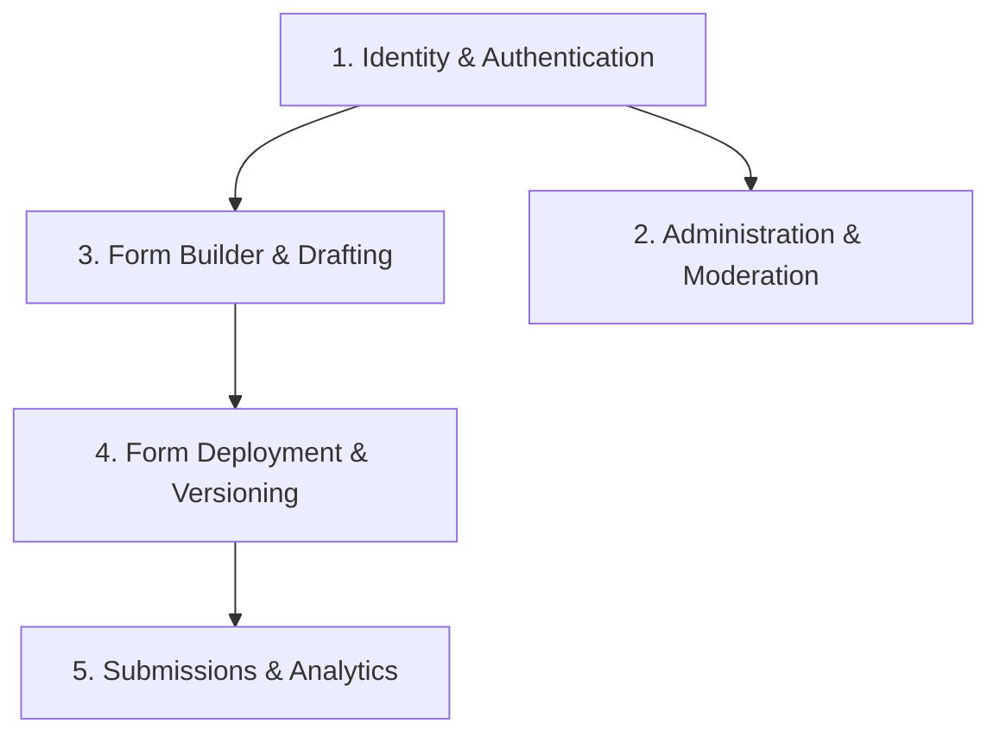

# Business Domains Overview

The platform is structured into five core business domains:

---

## Domain Catalog

1. [**Identity & Authentication**](file:///c:/Users/Muhammed%20Jasim/machine-test/docs/domains/identity-authentication.md): User accounts, bcrypt hashing, JWT issuance, profile updates.
2. [**Administration & Moderation**](file:///c:/Users/Muhammed%20Jasim/machine-test/docs/domains/administration-moderation.md): Admin user search, suspension/unsuspension, and platform dashboard metrics.
3. [**Form Builder & Drafting**](file:///c:/Users/Muhammed%20Jasim/machine-test/docs/domains/form-builder-drafting.md): Hierarchical canvas (Sections $\to$ Zones $\to$ Elements), properties panel, continuous draft autosave.
4. [**Form Deployment & Versioning**](file:///c:/Users/Muhammed%20Jasim/machine-test/docs/domains/form-deployment-versioning.md): Release snapshotting, immutable version records, deployment history, activity logs.
5. [**Form Submissions & Analytics**](file:///c:/Users/Muhammed%20Jasim/machine-test/docs/domains/form-submissions-analytics.md): Public form intake, schema validation, data tables, CSV streaming export.
