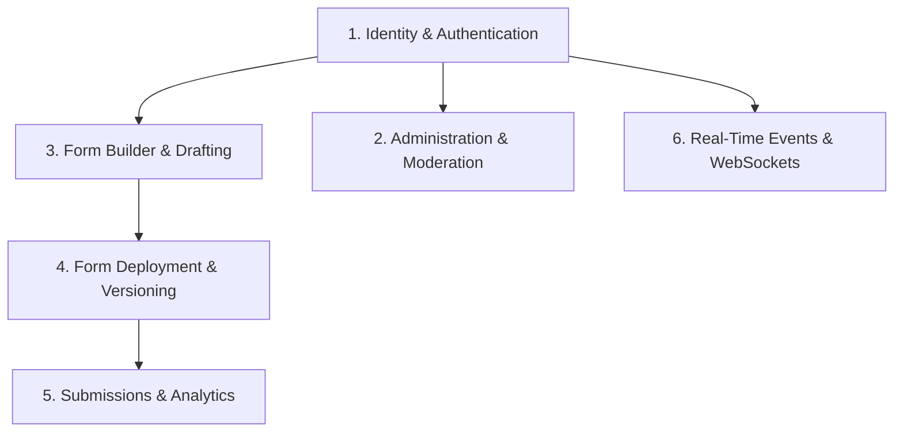

# Business Domains Overview

The platform is structured into six core business domains:

---

## Domain Catalog

1. [**Identity & Authentication**](identity-authentication.md): User accounts, bcrypt hashing, JWT issuance, refresh token rotation, profile updates.
2. [**Administration & Moderation**](administration-moderation.md): Admin user search, suspension/unsuspension, and platform dashboard metrics.
3. [**Form Builder & Drafting**](form-builder-drafting.md): Hierarchical canvas (Sections $\to$ Zones $\to$ Elements), properties panel, continuous draft autosave.
4. [**Form Deployment & Versioning**](form-deployment-versioning.md): Release snapshotting, immutable version records, deployment concurrency retry, deployment history, activity logs.
5. [**Form Submissions & Analytics**](form-submissions-analytics.md): Public form intake, schema validation, data tables, CSV streaming export, background webhook dispatch.
6. [**Real-Time Events & WebSockets**](realtime-events.md): Socket.IO events, Redis pub/sub adapter, authorized rooms, instant session revocation.
