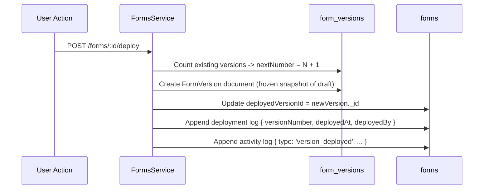

# Domain: Form Deployment & Versioning

> **Scope**: Release deployment, immutable version snapshots, deployment logs, and activity audit trails.  
> **Source of Truth**: [`apps/api/src/forms/forms.service.ts`](file:///c:/Users/Muhammed%20Jasim/machine-test/apps/api/src/forms/forms.service.ts) and [`apps/api/src/forms/schemas/form-version.schema.ts`](file:///c:/Users/Muhammed%20Jasim/machine-test/apps/api/src/forms/schemas/form-version.schema.ts).  
> **Last Verified**: 2026-09-24

---

## 1. Release Lifecycle & Snapshotting

---

## 2. Invariants & Rules

1. **Immutability**: Once a `FormVersion` document is saved, its `elements`, `sections`, and layout properties are immutable.
2. **Sequential Versioning**: Version numbers increment monotonically (`1, 2, 3...`) per form.
3. **Draft Independence**: Publishing creates a snapshot copy. Subsequent edits to `Form.draft` do not modify the published version until the next explicit deployment.
