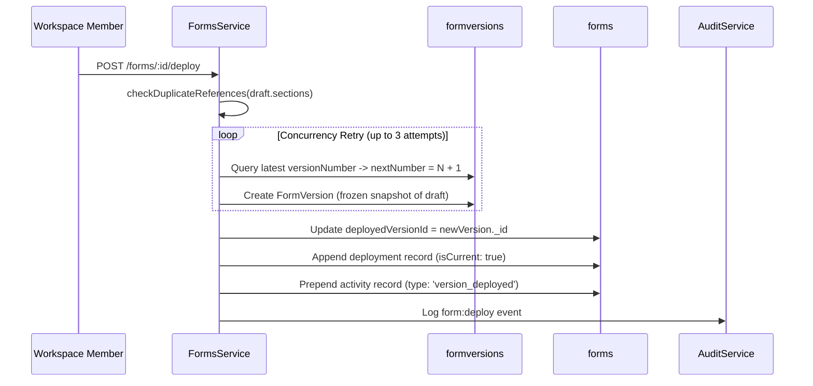

# Domain: Form Deployment & Versioning

> **Scope**: Release deployment, immutable version snapshots, concurrency-safe releases, and rollback/reactivation.  
> **Source of Truth**: [`apps/api/src/forms/forms.service.ts`](file:///home/sct/dd/multi-tenant-form-builder/apps/api/src/forms/forms.service.ts) and [`apps/api/src/forms/schemas/form-version.schema.ts`](file:///home/sct/dd/multi-tenant-form-builder/apps/api/src/forms/schemas/form-version.schema.ts).  
> **Last Verified**: 2026-09-25

---

## 1. Release Lifecycle & Concurrency-Safe Snapshotting

---

## 2. Invariants & Rules

1. **Deployment and Versioning are One Operation**:
   * Invoking `POST /forms/:id/deploy` releases the current draft and immediately updates `deployedVersionId`.
2. **Duplicate Reference Prevention**:
   * Deployment validates that all field references across zones and sections are globally unique within the form (`checkDuplicateReferences`). Colleague attempts to publish duplicate keys are blocked with HTTP 400.
3. **Concurrency-Safe Atomic Increments**:
   * Compound unique index `{ formId: 1, versionNumber: 1 }` prevents version duplication.
   * If concurrent deploys collide, MongoDB throws error `11000`; `FormsService` catches the conflict and executes an atomic retry loop.
4. **Historical Immutability & Rollback**:
   * Historical `FormVersion` records are permanently frozen.
   * Rollback / Re-activation (`POST /forms/:id/versions/:versionId/deploy`) simply points `Form.deployedVersionId` to an existing historical version without creating duplicate snapshots or mutating past releases.
