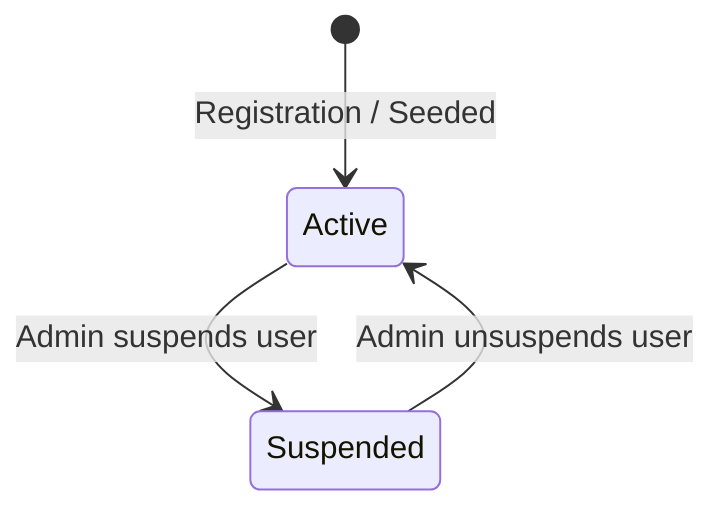

# Domain: Identity & Authentication

> **Scope**: User registration, login, JWT issuance, profile management, and account lifecycle.  
> **Source of Truth**: [`apps/api/src/auth/`](file:///c:/Users/Muhammed%20Jasim/machine-test/apps/api/src/auth/) and [`apps/api/src/users/`](file:///c:/Users/Muhammed%20Jasim/machine-test/apps/api/src/users/).  
> **Last Verified**: 2026-09-24

---

## 1. Entities & Data Model

- **Entity**: `User`
- **Fields**:
  - `id`: Unique string (ObjectId).
  - `name`: User's full name.
  - `email`: Normalized lowercase email string (unique index).
  - `passwordHash`: Bcrypt hash (10 salt rounds, stripped in `.toJSON()`).
  - `role`: `Role.ADMIN` | `Role.USER` (default: `USER`).
  - `status`: `UserStatus.ACTIVE` | `UserStatus.SUSPENDED` (default: `ACTIVE`).
  - `createdAt`, `updatedAt`: Timestamps.

---

## 2. User Lifecycle & State Transitions

- **Registration (`POST /auth/register`)**: Only standard users (`Role.USER`) can be registered via the API.
- **Login (`POST /auth/login`)**: Verifies password hash and checks that status is `ACTIVE`. Returns JWT `{ accessToken, user }`.
- **Profile (`PATCH /users/me`)**: Allows active users to update `name` and `email`. Protected fields (`role`, `status`) cannot be modified by users.
