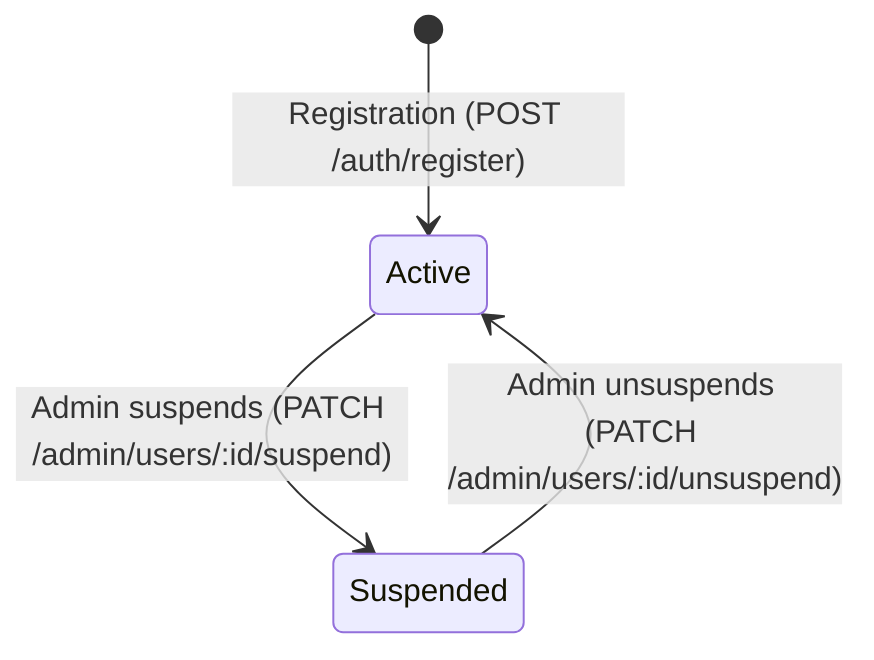

# Domain: Identity & Authentication

> **Scope**: User registration, login, JWT issuance, refresh token rotation, session revocation, and profile management.  
> **Source of Truth**: [`apps/api/src/auth/`](file:///home/sct/dd/multi-tenant-form-builder/apps/api/src/auth/) and [`apps/api/src/users/`](file:///home/sct/dd/multi-tenant-form-builder/apps/api/src/users/).  
> **Last Verified**: 2026-09-25

---

## 1. Entities & Data Model

### Entity: `User`
* **Schema**: [`apps/api/src/users/schemas/user.schema.ts`](file:///home/sct/dd/multi-tenant-form-builder/apps/api/src/users/schemas/user.schema.ts)
* **Fields**:
  - `id`: Unique string (ObjectId).
  - `name`: User's full name.
  - `email`: Normalized lowercase string (unique index).
  - `passwordHash`: Bcrypt hash (10 salt rounds, stripped in `.toJSON()`).
  - `role`: `Role.ADMIN` | `Role.USER` (default: `USER`).
  - `status`: `UserStatus.ACTIVE` | `UserStatus.SUSPENDED` (default: `ACTIVE`).
  - `tenantId`: Explicit tenant identifier (default: user's `id`).
  - `permissions`: Fine-grained permission strings (`forms:*`, `submissions:*`, `users:*`).
  - `tokenVersion`: Monotonically increasing session version counter.

### Entity: `RefreshToken`
* **Schema**: [`apps/api/src/identity/schemas/refresh-token.schema.ts`](file:///home/sct/dd/multi-tenant-form-builder/apps/api/src/identity/schemas/refresh-token.schema.ts)
* **Fields**: `userId`, `tenantId`, `tokenHash`, `family`, `isRevoked`, `expiresAt`

---

## 2. User Lifecycle & State Transitions

1. **Registration (`POST /auth/register`)**: Provisions active standard user with default user permissions and distinct tenant context.
2. **Login (`POST /auth/login`)**: Validates credentials with bcrypt, checks `status === 'ACTIVE'`, and issues a 15-minute access token and 7-day refresh token.
3. **Token Refresh (`POST /auth/refresh`)**: Rotates refresh tokens within token family; detects replay attacks and revokes the compromised family.
4. **Password Change (`POST /auth/change-password`)**: Updates password hash and increments `tokenVersion`, invalidating all active sessions.
5. **Logout All (`POST /auth/logout-all`)**: Increments `tokenVersion` to immediately disconnect all devices.
