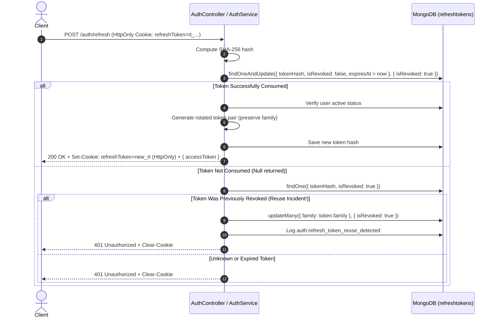

# Security: Authentication Architecture

> **Scope**: Registration, password hashing, in-memory short-lived JWT access tokens, HttpOnly refresh token cookies, atomic token rotation, token family tracking, reuse detection, session revocation, token versioning, password change, logout, authorization guards, tenant context, audit logging, and secret management.  
> **Source of Truth**: `apps/api/src/auth/`, `apps/api/src/identity/`, `apps/api/src/users/`, `apps/api/src/common/guards/`, `apps/api/src/infrastructure/vault/`, `apps/api/src/infrastructure/audit/`, `apps/web/src/app/providers/AuthProvider.tsx`, `apps/web/src/services/api.ts`, and `apps/web/src/app/providers/SocketProvider.tsx`.  
> **Last Verified**: 2026-09-25  
> **Implementation Status**: Implemented & Verified

---

## 1. Scope

This document provides the definitive architectural specification of the authentication and session management subsystem across both backend services and the frontend single-page application. It covers credential intake, cryptographic storage, token generation, in-memory client isolation, HttpOnly cookie transport, signature and claim verification, atomic token rotation, family-based reuse detection, session revocation, token versioning, tenant derivation, role/permission authorization, client logout cleanup, single-flight refresh coordination, and audit trail logging.

---

## 2. Source of Truth

The authoritative sources of truth for this architecture are:
- **Frontend Auth & Storage**: [`apps/web/src/app/providers/AuthProvider.tsx`](file:///home/sct/dd/multi-tenant-form-builder/apps/web/src/app/providers/AuthProvider.tsx), [`apps/web/src/services/api.ts`](file:///home/sct/dd/multi-tenant-form-builder/apps/web/src/services/api.ts), [`apps/web/src/app/providers/SocketProvider.tsx`](file:///home/sct/dd/multi-tenant-form-builder/apps/web/src/app/providers/SocketProvider.tsx)
- **Backend Auth Service & Controller**: [`apps/api/src/auth/auth.service.ts`](file:///home/sct/dd/multi-tenant-form-builder/apps/api/src/auth/auth.service.ts), [`apps/api/src/auth/auth.controller.ts`](file:///home/sct/dd/multi-tenant-form-builder/apps/api/src/auth/auth.controller.ts)
- **JWT Strategy & Module**: [`apps/api/src/auth/strategies/jwt.strategy.ts`](file:///home/sct/dd/multi-tenant-form-builder/apps/api/src/auth/strategies/jwt.strategy.ts), [`apps/api/src/auth/auth.module.ts`](file:///home/sct/dd/multi-tenant-form-builder/apps/api/src/auth/auth.module.ts)
- **Guards & Decorators**: [`apps/api/src/common/guards/`](file:///home/sct/dd/multi-tenant-form-builder/apps/api/src/common/guards/), [`apps/api/src/common/decorators/`](file:///home/sct/dd/multi-tenant-form-builder/apps/api/src/common/decorators/)
- **Database Schemas**: [`apps/api/src/users/schemas/user.schema.ts`](file:///home/sct/dd/multi-tenant-form-builder/apps/api/src/users/schemas/user.schema.ts), [`apps/api/src/identity/schemas/refresh-token.schema.ts`](file:///home/sct/dd/multi-tenant-form-builder/apps/api/src/identity/schemas/refresh-token.schema.ts)
- **Secrets Management**: [`apps/api/src/infrastructure/vault/secrets.service.ts`](file:///home/sct/dd/multi-tenant-form-builder/apps/api/src/infrastructure/vault/secrets.service.ts)
- **Audit Logging**: [`apps/api/src/infrastructure/audit/audit.service.ts`](file:///home/sct/dd/multi-tenant-form-builder/apps/api/src/infrastructure/audit/audit.service.ts)

---

## 3. Target Authentication Architecture

```text
                    Authentication
                          │
             ┌────────────┴────────────┐
             │                         │
       Access Token              Refresh Token
             │                         │
        Memory Only              HttpOnly Cookie
             │                         │
             ▼                         ▼
      API Authorization          /auth/refresh
             │                         │
             └────────────┬────────────┘
                          ▼
                    JWT Strategy
                          │
                          ▼
                    Current User
                          │
             ┌────────────┼────────────┐
             ▼            ▼            ▼
           Status       Tenant      Permissions
             │            │            │
             └────────────┼────────────┘
                          ▼
                    Authorization
```

---

## 4. Client-Side Token Storage

### 4.1 Storage Mechanisms
- **Access Token Storage**: Exists strictly in **application memory** (`inMemoryAccessToken` in `api.ts` and React state in `AuthProvider.tsx`). It is **never** written to `localStorage`, `sessionStorage`, or `document.cookie`.
- **Refresh Token Storage**: Exists strictly in an **`HttpOnly` browser cookie** managed by the API backend. It is never exposed to JavaScript, React, window, or client storage.
- **User Profile State**: Maintained in React Context state (`useState<UserDto | null>(null)` in `AuthProvider.tsx`). Hydrated dynamically upon application load or reload by requesting a token rotation via `POST /auth/refresh` (cookie attached automatically) followed by `GET /users/me`.
- **Auxiliary Client Storage**:
  - `localStorage.getItem('last_user_email')`: Retained strictly for pre-filling the login email input.
  - `sessionStorage.getItem('suspended_email')`: Written transiently upon account suspension to display the suspended user's email on `AccountSuspendedPage`.
- **Cookie Security Attributes**:
  - `HttpOnly: true` (prevents JavaScript/XSS access)
  - `Secure: true` in production (`process.env.NODE_ENV === 'production'`)
  - `SameSite: 'lax'` (CSRF protection while supporting standard web navigation)
  - `Path: '/auth'` (restricts cookie transmission exclusively to authentication endpoints)
  - `Max-Age: 7 * 24 * 60 * 60 * 1000` (7 days)

### 4.2 Request Injection
- In [`apps/web/src/services/api.ts`](file:///home/sct/dd/multi-tenant-form-builder/apps/web/src/services/api.ts), outgoing HTTP requests inspect `inMemoryAccessToken`.
- If an in-memory token exists, it is attached as:
  ```text
  Authorization: Bearer <inMemoryAccessToken>
  ```
- Every fetch request specifies `credentials: 'include'` to allow the browser to transmit and receive the HttpOnly refresh token cookie on `/auth/*` endpoints.
- In [`apps/web/src/app/providers/SocketProvider.tsx`](file:///home/sct/dd/multi-tenant-form-builder/apps/web/src/app/providers/SocketProvider.tsx), the real-time client authenticates by passing `{ auth: { token } }` directly from React memory state. When the access token is rotated, the socket connection updates with the fresh token.

### 4.3 Automatic Single-Flight Refresh Interception
- When an authenticated request fails with HTTP `401 Unauthorized` (and is not an `/auth/` call or retry):
  1. The API client intercepts the 401 response.
  2. If a refresh is not already in progress, it initiates `performTokenRefresh()`, sending `POST /auth/refresh` with `credentials: 'include'`.
  3. If multiple requests fail with 401 concurrently, they all await the exact same single-flight `refreshPromise`.
  4. On successful refresh:
     - The new access token is stored in memory (`setAccessToken`).
     - A custom event `saas:token-refreshed` synchronizes React state in `AuthProvider`.
     - The original request(s) are automatically retried with the new access token.
  5. On refresh failure (e.g., revoked cookie or expired session):
     - Memory tokens are cleared.
     - Event `saas:auth-failure` is broadcast.
     - `AuthProvider` resets auth context and navigates the user to `/login`.

### 4.4 Application Initialization on Browser Reload
1. User reloads browser $\to$ in-memory access token is lost.
2. `AuthProvider` mounts and executes `initAuth()`.
3. `authService.refreshToken()` issues `POST /auth/refresh`.
4. Browser automatically transmits the HttpOnly `refreshToken` cookie.
5. API rotates the refresh token, sets a new HttpOnly cookie, and returns a fresh access token.
6. Frontend saves the access token in memory, queries `GET /users/me`, and restores the user session without requiring credential re-entry.

### 4.5 Logout Cleanup Behavior
- When the user clicks Logout:
  1. Frontend calls `authService.logout()`, issuing `POST /auth/logout` with `credentials: 'include'`.
  2. Backend revokes the refresh token record in MongoDB and sets `clearCookie('refreshToken', { path: '/auth' })`.
  3. Frontend clears in-memory access token (`setAccessToken(null)`).
  4. Frontend resets React `user` and `token` state to `null`.
  5. User is redirected to `/login`.
  6. If the network call fails or the server is unreachable, client-side cleanup still completes unconditionally.

### 4.6 Client Token Storage Security

Authentication tokens are isolated:
- Access tokens exist strictly in volatile application memory, completely mitigating persistent storage extraction.
- Refresh tokens are confined to an `HttpOnly` cookie with `Path: /auth`, preventing JavaScript reading, DOM inspection, and XSS exfiltration.

---

## 5. Registration

- **Endpoint**: `POST /auth/register` (Public, throttled at 10 requests / 60 seconds).
- **Validation DTO**: `RegisterDto`:
  - `name`: String, non-empty, minimum length 2.
  - `email`: Valid email format, normalized to lowercase and trimmed.
  - `password`: String, non-empty, minimum length 6.
- **Duplicate Prevention**:
  - Checks `UsersService.findByEmail(dto.email.toLowerCase().trim())`.
  - Duplicate email records an audit failure event (`auth:register_duplicate`) and throws HTTP `409 ConflictException` ("Email address is already in use").
  - Protected at database level via MongoDB unique index `{ email: 1 }`.
- **Session Creation**:
  - Generates access token (15m, HS256).
  - Generates refresh token (32 cryptographically random bytes), persists its SHA-256 hash in `refreshtokens`.
  - Sets HttpOnly `refreshToken` cookie on the HTTP response.
  - Returns `{ accessToken, user }`. Raw refresh token is omitted from response JSON.
- **Audit**: Writes `auth:register` event with actor and correlation details.

---

## 6. Password Security

- **Hashing Algorithm**: `bcryptjs` with configured salt rounds = `10`.
- **Storage Field**: Stored strictly in `User.passwordHash` in the `users` MongoDB collection.
- **Serialization Protection**:
  - The Mongoose `UserSchema` defines a `toJSON` transform that permanently deletes `ret.passwordHash`, `ret._id`, and `ret.__v` before any document is serialized to JSON.
  - `UserDto` contract does not contain a password field.
- **Password Verification**:
  - Performed using `bcrypt.compare(candidatePassword, user.passwordHash)`.
  - Invalid credentials throw HTTP `401 UnauthorizedException` ("Invalid email or password").
- **Password Change Enforcement**:
  - Handled by `POST /auth/change-password` guarded by `JwtAuthGuard` and `ActiveUserGuard`.
  - Requires `currentPassword` and `newPassword` (minimum 8 characters).
  - Validates `currentPassword` via `bcrypt.compare`.
  - Generates new hash with salt rounds = 10.
  - Calls `UsersService.updatePassword()`, which atomically updates `passwordHash` and increments `tokenVersion` (`{ $inc: { tokenVersion: 1 } }`).
  - Revokes all existing refresh tokens for the user in `refreshtokens`.
  - Clears the refresh token cookie.

---

## 7. JWT Access Token Lifecycle

- **Signing Algorithm**: Explicitly locked to `HS256` in `JwtModule.registerAsync` and `JwtStrategy`.
- **Token Lifetime**: 15 minutes (`expiresIn: '15m'`).
- **Signing Secret**: Retrieved dynamically at startup via `SecretsService.getJwtSecret()` from HashiCorp Vault or environment. Production startup fails if the secret is missing or set to the known default.
- **Minimal Claims Payload**:
  ```json
  {
    "sub": "6510a1b2c3d4e5f6a7b8c9d0",
    "tokenVersion": 1,
    "iss": "saas-platform",
    "aud": "saas-api",
    "iat": 1758790000,
    "exp": 1758790900
  }
  ```
- **Claim Authority**: Mutable authorization claims (`role`, `permissions`, `tenantId`, `status`) are **not** relied upon from the JWT payload. They are queried live from MongoDB during `JwtStrategy.validate()`.

---

## 8. JWT Validation

JWT validation is executed on every protected HTTP request by `JwtStrategy` (extending `@nestjs/passport` `Strategy`):

### 8.1 Enforced Validation Checks
1. **Extraction**: `ExtractJwt.fromAuthHeaderAsBearerToken()`.
2. **Signature**: Verified against `SecretsService.getJwtSecret()`.
3. **Algorithm**: Enforced to `algorithms: ['HS256']`.
4. **Issuer**: Explicitly validated as `issuer: 'saas-platform'`.
5. **Audience**: Explicitly validated as `audience: 'saas-api'`.
6. **Expiration**: Enforced via `ignoreExpiration: false`.
7. **Database Lookup**: Queries `UsersService.findById(payload.sub)`. Deleted users throw HTTP 401.
8. **Token Version Verification**: `payload.tokenVersion` is compared against `user.tokenVersion`. If `payload.tokenVersion < user.tokenVersion`, throws HTTP 401.
9. **Account Status Verification**: Suspended users are rejected with HTTP 403 (`ACCOUNT_SUSPENDED`).

---

## 9. Refresh Token Lifecycle

- **Token Generation**: Uses cryptographically secure pseudorandom byte generation:
  ```typescript
  const rawRefreshToken = `rt_${randomBytes(32).toString('hex')}`;
  ```
- **Token Hashing & Storage**:
  - The raw refresh token is **never** saved to the database.
  - Only its SHA-256 hash is persisted:
    ```typescript
    const tokenHash = createHash('sha256').update(rawRefreshToken).digest('hex');
    ```
- **Token Lifetime**: 7 days (`expiresAt = now + 7 days`).
- **Database Model**: Stored in the `refreshtokens` collection via `RefreshTokenSchema`.
- **TTL Index**: Configured with `{ expires: '7d' }` on `expiresAt` for MongoDB background cleanup.
- **Application Expiration Enforcement**: Validated against current clock time (`expiresAt: { $gt: now }`) during atomic lookup, preventing reliance solely on MongoDB TTL granularity.

---

## 10. Atomic Refresh Token Rotation

When a client submits its refresh cookie to `POST /auth/refresh`:



### Concurrency Protection & Single-Use Guarantee
Because `findOneAndUpdate` is executed atomically on MongoDB with `{ isRevoked: false }`, two simultaneous requests using the same refresh token can **only allow one request to succeed**. The second request receives `null`, immediately triggering the reuse detection pipeline and invalidating the token family.

---

## 11. Refresh Token Reuse Detection

- **Trigger**: When a token hash presented to `/auth/refresh` matches an existing record where `isRevoked === true`.
- **Action**:
  1. Identifies token theft or replay.
  2. All refresh tokens belonging to `family: storedToken.family` are immediately marked `isRevoked: true`.
  3. High-priority audit event `auth:refresh_token_reuse_detected` is recorded.
  4. Response clears the client's `refreshToken` cookie.
  5. Throws HTTP `401 UnauthorizedException` ("Security alert: Refresh token reuse detected. All sessions in family revoked.").

---

## 12. Session Revocation

The platform supports granular and user-wide revocation mechanisms:

| Trigger | Mechanism | Invalidation Scope | Latency |
|---|---|---|---|
| **Single Logout** (`POST /auth/logout`) | `updateOne({ tokenHash }, { isRevoked: true })` + `clearCookie` | Current refresh token invalidated; cookie cleared. | Immediate. |
| **Token Reuse** (`POST /auth/refresh`) | `updateMany({ family }, { isRevoked: true })` + `clearCookie` | Entire refresh token family invalidated. | Immediate. |
| **Logout All** (`POST /auth/logout-all`) | `updateMany({ userId }, { isRevoked: true })` + `incrementTokenVersion(userId)` | All refresh tokens revoked; `tokenVersion` incremented. | **Immediate**: Next HTTP request fails in `JwtStrategy`. |
| **Password Change** (`POST /auth/change-password`) | `updateMany({ userId }, { isRevoked: true })` + `updatePassword(userId)` | All refresh tokens revoked; `tokenVersion` incremented. | **Immediate**: Next HTTP request fails in `JwtStrategy`. |
| **Admin Suspension** (`PATCH /admin/users/:id/suspend`) | Sets `status: SUSPENDED` + emits `user:suspended` socket event | `ActiveUserGuard` blocks all HTTP requests; WebSockets disconnected; refresh blocked. | **Immediate**: HTTP requests blocked; active UI tabs redirected. |

---

## 13. Token Versioning

- **Database Property**: `tokenVersion: number` on the `User` schema (initial value: `1`).
- **JWT Inclusion**: Included as `tokenVersion` in the minimal JWT payload.
- **Enforcement**:
  - `JwtStrategy.validate(payload)` executes on every authenticated request:
    ```typescript
    if (payload.tokenVersion && user.tokenVersion && payload.tokenVersion < user.tokenVersion) {
      throw new UnauthorizedException('Session has been revoked or password was changed. Please re-authenticate.');
    }
    ```
  - `RealtimeGateway.handleConnection(client)` executes on every WebSocket connection:
    ```typescript
    if (presentedTokenVersion !== expectedTokenVersion) {
      client.disconnect();
    }
    ```
- **Revocation Speed**: Because `JwtStrategy` performs a database lookup on every request, `tokenVersion` invalidation is **immediate cluster-wide** without waiting for access token expiration.

---

## 14. Tenant Context

- **Server-Side Derivation**: The authenticated tenant context is determined strictly by the backend and injected via the `@CurrentTenant()` decorator.
- **Resolution Precedence**:
  ```typescript
  const tenantId = request.user?.tenantId || request.tenantId || request.user?.id;
  ```
- **Source of Value**: `request.user` is populated by `JwtStrategy.validate()`, which extracts `user.tenantId` from the **database user record** (`user.tenantId || user._id.toString()`).
- **Header Tampering Resistance**: Client-provided headers (`X-Tenant-ID`) or query parameters are ignored. A user cannot access or query data outside their server-resolved `tenantId`.

---

## 15. Role and Permission Authorization

- **Authorization Model**: Hybrid RBAC + Fine-Grained Permissions.
- **Authoritative Source**:
  - `JwtStrategy.validate` queries the database and populates `req.user.role` and `req.user.permissions` directly from MongoDB.
  - If an administrator modifies a user's role or permissions in the database, the change takes effect **immediately on their next HTTP request**.
- **Guard Execution Flow**:
  ```text
  Client Request
       ↓
  JwtAuthGuard (Validates token, issuer, audience, extracts sub, checks tokenVersion in DB)
       ↓
  ActiveUserGuard (Verifies user.status !== SUSPENDED)
       ↓
  RolesGuard (Checks @Roles(...) against req.user.role)
       ↓
  PermissionsGuard (Checks @RequirePermissions(...) against req.user.permissions)
       ↓
  Controller Route Handler
  ```
- **Administrator Bypass**: In `PermissionsGuard`, users with `role === Role.ADMIN` automatically satisfy all permission checks.

---

## 16. Logout

- **Endpoint**: `POST /auth/logout` (Public / Semi-authenticated).
- **Behavior**:
  - Obtains `refreshToken` from the HttpOnly cookie (or fallback body).
  - Hashes token and marks record `isRevoked: true`.
  - Clears `refreshToken` cookie on HTTP response.
  - Frontend wipes in-memory access token and resets React user context.

---

## 17. Logout-All

- **Endpoint**: `POST /auth/logout-all` (Protected by `JwtAuthGuard` and `ActiveUserGuard`).
- **Behavior**:
  1. Revokes all refresh tokens belonging to the user:
     ```typescript
     await this.refreshTokenModel.updateMany({ userId }, { isRevoked: true }).exec();
     ```
  2. Atomically increments user `tokenVersion`:
     ```typescript
     await this.usersService.incrementTokenVersion(userId);
     ```
  3. Clears `refreshToken` cookie.
  4. Writes audit event `auth:logout_all_sessions`.
- **Result**: All refresh tokens are invalidated, and all issued access tokens are immediately rejected on their next request across all client instances.

---

## 18. Password Change

- **Endpoint**: `POST /auth/change-password` (Protected by `JwtAuthGuard` and `ActiveUserGuard`).
- **DTO**: `ChangePasswordDto` (`currentPassword`, `newPassword` minimum 8 characters).
- **Behavior**:
  1. Verifies `currentPassword` against `user.passwordHash` via `bcrypt.compare`.
  2. Hashes `newPassword` with salt rounds = 10.
  3. Calls `UsersService.updatePassword()`, which updates `passwordHash` and increments `tokenVersion`.
  4. Revokes all active refresh tokens in `refreshtokens`.
  5. Clears `refreshToken` cookie.
  6. Writes audit event `auth:change_password`.
- **Result**: All active sessions across all devices are immediately terminated.

---

## 19. Audit Events

All authentication actions trigger structured audit logging via `AuditService` into the `auditlogs` collection. Raw access tokens, raw refresh tokens, passwords, password hashes, cookies, and Authorization headers are **never** logged:

| Audit Action | Actor | Result | Metadata Logged |
|---|---|---|---|
| `auth:register` | User ID | `SUCCESS` | IP, User-Agent, Correlation ID, Email |
| `auth:register_duplicate` | None (`system`) | `FAILURE` | IP, User-Agent, Correlation ID, Target Email |
| `auth:login` | User ID | `SUCCESS` | IP, User-Agent, Correlation ID, Tenant ID |
| `auth:failed_login` | None / User ID | `FAILURE` | IP, User-Agent, Correlation ID, Reason (Password mismatch / Not found) |
| `auth:login_suspended` | User ID | `FAILURE` | IP, User-Agent, Correlation ID, Reason (Account suspended) |
| `auth:token_refreshed` | User ID | `SUCCESS` | IP, User-Agent, Correlation ID |
| `auth:refresh_token_reuse_detected` | Stored User ID | `FAILURE` | IP, User-Agent, Correlation ID, Token Family ID |
| `auth:logout` | User ID | `SUCCESS` | IP, User-Agent, Correlation ID |
| `auth:logout_all_sessions` | User ID | `SUCCESS` | IP, User-Agent, Correlation ID |
| `auth:change_password` | User ID | `SUCCESS` | IP, User-Agent, Correlation ID |
| `auth:change_password_failed` | User ID | `FAILURE` | IP, User-Agent, Correlation ID, Reason |
| `user:suspended` | Admin ID | `SUCCESS` | IP, User-Agent, Correlation ID, Target Email |

---

## 20. Secret Management

- **Secrets Provider**: `SecretsService` (`apps/api/src/infrastructure/vault/secrets.service.ts`).
- **Vault Integration**:
  - When `VAULT_ENABLED === 'true'`, authenticates against HashiCorp Vault at `VAULT_ADDR` using `VAULT_TOKEN`.
  - Reads secrets from KV engine path `VAULT_PATH` (`secret/data/saas-api`).
- **Production Hardening**:
  - In production (`NODE_ENV === 'production'`), startup throws a fatal error if `JWT_SECRET` is unset or equals the development default (`super-secret-jwt-key-for-saas-platform-change-in-prod`).
  - Production startup fails immediately if HashiCorp Vault is unreachable when enabled.
- **Development Fallback**: In development only, falls back to `ConfigService.get('JWT_SECRET')` or development default.

---

## 21. Authentication API Endpoints

| Method | Endpoint | Auth Required | Rate Limit | Request Body | Cookie Transport | Response |
|---|---|---|---|---|---|---|
| `POST` | `/auth/register` | None (Public) | 10 req / 60s | `RegisterDto` | Sets `refreshToken` (HttpOnly) | `{ accessToken, user }` |
| `POST` | `/auth/login` | None (Public) | 10 req / 60s | `LoginDto` | Sets `refreshToken` (HttpOnly) | `{ accessToken, user }` |
| `POST` | `/auth/refresh` | None (Cookie-based) | 30 req / 60s | Optional `RefreshTokenDto` | Receives & Sets `refreshToken` | `{ accessToken }` |
| `POST` | `/auth/logout` | Optional | Default | Optional `RefreshTokenDto` | Clears `refreshToken` | `{ message }` |
| `POST` | `/auth/logout-all` | `JwtAuthGuard`, `ActiveUserGuard` | Default | None | Clears `refreshToken` | `{ message }` |
| `POST` | `/auth/change-password` | `JwtAuthGuard`, `ActiveUserGuard` | Default | `ChangePasswordDto` | Clears `refreshToken` | `{ message }` |

---

## 22. Database Models

### 22.1 `users` Collection (`UserSchema`)
- `name`: `String` (required, trimmed)
- `email`: `String` (required, unique, lowercase, trimmed, indexed)
- `passwordHash`: `String` (required, excluded in `toJSON`)
- `role`: `Role` (`USER` | `ADMIN`, default: `USER`, indexed)
- `status`: `UserStatus` (`ACTIVE` | `SUSPENDED`, default: `ACTIVE`, indexed)
- `tenantId`: `String` (indexed, auto-assigned to `_id.toString()` if absent)
- `permissions`: `[String]` (default: `DEFAULT_USER_PERMISSIONS`)
- `tokenVersion`: `Number` (default: `1`, incremented on password change / logout-all)
- Indexes: `{ role: 1, status: 1 }`, `{ tenantId: 1, email: 1 }`, `{ createdAt: -1 }`

### 22.2 `refreshtokens` Collection (`RefreshTokenSchema`)
- `userId`: `ObjectId` (ref: `User`, required, indexed)
- `tenantId`: `String` (required, indexed)
- `tokenHash`: `String` (SHA-256 hex, required, unique, indexed)
- `family`: `String` (required, indexed)
- `isRevoked`: `Boolean` (default: `false`, indexed)
- `expiresAt`: `Date` (required, indexed with TTL `{ expires: '7d' }`)
- Indexes: `{ userId: 1, family: 1 }`, `{ userId: 1, isRevoked: 1 }`, `{ tokenHash: 1, isRevoked: 1, expiresAt: 1 }`

---

## 23. Security Guarantees

### Implemented & Verified
- [x] **In-Memory Access Tokens**: Access tokens exist strictly in frontend volatile memory and are never saved to localStorage, sessionStorage, or browser cookies.
- [x] **HttpOnly Refresh Cookies**: Refresh tokens are transported strictly via `HttpOnly`, `SameSite: lax`, `Path: /auth` cookies, completely isolated from client JavaScript.
- [x] **Automatic Single-Flight Refresh**: 401 errors are intercepted, and multiple concurrent requests coordinate on a single `/auth/refresh` flight before retrying original requests.
- [x] **Session Reconstruction on Reload**: Application reloads execute `/auth/refresh` via cookie to reconstruct in-memory state without requiring re-login.
- [x] **Atomic Refresh Rotation**: Uses atomic `findOneAndUpdate` with `{ isRevoked: false, expiresAt: { $gt: now } }`, strictly guaranteeing single-use consumption.
- [x] **Refresh Reuse Detection**: Presenting an already-consumed refresh token immediately revokes all sessions in its token family and logs an audit security event.
- [x] **Strict JWT Claim Enforcement**: Verified in Passport `JwtStrategy` with explicit enforcement of `algorithms: ['HS256']`, `issuer: 'saas-platform'`, `audience: 'saas-api'`, and expiration.
- [x] **Minimal JWT Claims**: Access tokens carry only `sub` and `tokenVersion`. Mutable permissions, roles, and tenant IDs are resolved live from MongoDB.
- [x] **Immediate Cluster-Wide Revocation**: `tokenVersion` increments on password change or `logout-all` immediately invalidate access tokens across all instances.
- [x] **Account Suspension Enforcement**: Suspended users are immediately blocked on HTTP via `ActiveUserGuard`, disconnected from WebSockets, and blocked from token rotation.
- [x] **Server-Derived Tenant Isolation**: `@CurrentTenant()` resolves strictly from the database user record, ignoring client header tampering.
- [x] **Production Secret Hardening**: Production startup throws a fatal error if `JWT_SECRET` is unset or set to the default insecure development string.
- [x] **Passwords Securely Hashed**: `bcryptjs` with salt rounds = 10, stripped permanently in Mongoose `toJSON`.
- [x] **Structured Security Auditing**: All authentication attempts, successes, failures, and reuse alerts are audited without sensitive data leakage.

### Not Implemented
- [ ] **Multi-Factor Authentication (MFA/TOTP)**: Not present in current codebase.
- [ ] **OAuth2 / Social Login**: No third-party OAuth providers configured.

---

## 24. Known Limitations

1. **Short-Lived Access Token Invalidation Window on Single Logout**:
   - Calling `POST /auth/logout` revokes the refresh token and clears the HttpOnly cookie.
   - However, the 15-minute in-memory access token remains valid for its remaining lifetime if an attacker has already extracted it from memory. Users desiring immediate cluster-wide revocation across all active tokens must use `POST /auth/logout-all`.
2. **MongoDB TTL Background Thread**:
   - Physical document cleanup of expired refresh tokens is handled by MongoDB's background TTL thread (running every 60 seconds). However, application-level atomic queries (`expiresAt: { $gt: now }`) guarantee that expired tokens cannot be consumed even before physical deletion occurs.
